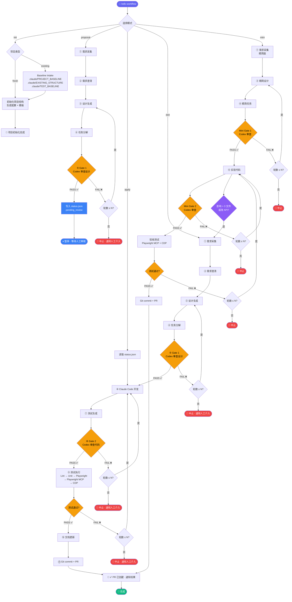

# 设计理念 SDLC Workflow Suite

> **让 AI 按工程规矩干活，而不是自由发挥。**
>
> 一套面向 Claude Code 的全流程 SDLC 自动化技能——从需求拆解到 PR 合并，中间有人工审核、设计审查、代码审查、浏览器验收，每一步都有产物、有证据、可恢复。

---

## 为什么需要它

你已经在用 Claude Code / Cursor / codex / gemini 写代码了。但你大概率遇到过这些场面：

| 痛点 | 你现在怎么处理 | 用了这套系统之后 |
|------|--------------|----------------|
| 模型擅自把目录结构改了 | 事后人工修，或者放弃 | 目录约束作为规则注入，改不了 |
| AI 设计方案没经过人审就直接写代码 | 写完才发现方向不对 | proposal 暂停等人工审核，apply 才开始开发 |
| 说"已完成"但实际没测 | 手动逐个验证 | 最终通过必须有浏览器交互证据 |
| 老项目交给 AI，被当新项目重建 | 反复解释"别动现有架构" | 先 intake 再开发，baseline 锁定现有结构 |
| 审查全靠自己看 diff | 通常看不过来就跳过了 | Codex CLI 自动审查，Gate 失败就停 |
| 做了什么改动，过两天就忘 | 翻 Git log 猜 | 每轮需求生成独立 iteration 目录，含 requirements/design/tasks |
| 小改动不想跑全流程 | 直接裸改，没记录 | mini 模式：精简流程，但仍有 Gate 和验收 |

**一句话总结**：这是一套用**工程 contract** 而非 prompt 技巧来约束 AI 行为的 SDLC 系统。

---

## 30 秒理解它做了什么

```
你说一个需求
  ↓
自动生成 requirements → design → tasks          ← 有产物
  ↓
Codex CLI 审查设计（Gate 1）                     ← 有门禁
  ↓
Claude Code 按 tasks 逐条实现                    ← 有约束
  ↓
自动生成测试 → Codex CLI 审查代码（Gate 2）       ← 有门禁
  ↓
Lint → Unit → Playwright → Playwright MCP   ← 有验收
  ↓
更新文档 → Git commit → 创建 PR                  ← 有交付
  ↓
TG/Telegram 通知你结果                           ← 有通知

```


## 核心命令

```bash
# 初始化：接入你的项目（tg= 用户账号数字ID）
/sdlc-workflow init "tg=123456789 review=1"

# 需求拆解：拆解需求 + Gate 1 审查 → 暂停等人工审核
/sdlc-workflow proposal 增加用户登录模块

# 审核通过后：继续开发 → 测试 → Gate 2 → PR
/sdlc-workflow apply

# 全自动：Proposal + Apply 不停顿
/sdlc-workflow doit 增加用户登录模块

# 小任务：走精简流程，但不跳过 Gate
/sdlc-workflow mini 把首页背景改成黑色
```

五种模式，一个入口。推荐流程：`proposal` → 人工审核 → `apply`。

> **前置条件**：使用 TG 通知前需先配置 OpenClaw CLI（`npm i -g openclaw && openclaw auth login && openclaw channel connect telegram`），获取你的 Telegram 账号数字 ID 或 chat_id。

---

## 它的设计哲学

### 1. 结构约束先于模型智能

不靠 prompt 告诉模型"请不要乱改目录"，而是把结构规则直接注入 workflow：

```
✅ 允许：apps/web, apps/server, packages/*
🚫 禁止：模型自建 web/, api/, server/, frontend/, backend/
```

### 2. Existing Project 是常态

真实的项目几乎都不是从零开始的。系统检测到现有项目后：

```
检测到 package.json, .git/, src/ → 判定为 existing project
  ↓
生成 .claude/PROJECT_BASELINE.md     ← 锁定现有技术栈
生成 .claude/EXISTING_STRUCTURE.md   ← 锁定现有目录结构
生成 .claude/TEST_BASELINE.md        ← 盘点现有测试能力
  ↓
后续所有 design 必须引用 baseline，不能自由发挥
```

### 3. 双模型把关，不可降级

```
Claude Code → 生成代码和设计
Codex CLI   → 独立审查（Gate 1 审设计，Gate 2 审代码）

审查失败 → 修订 → 重新审查（最多 N 轮）
审查工具不可用 → 中止 + 通知人工
                 ❌ 不允许静默跳过
```

### 4. 证据优先（Evidence First）

所有结论分两级：

| 级别 | 含义 | 来源 |
|------|------|------|
| **Verified** | 经过验证的事实 | 真实文件、命令输出、测试报告、浏览器截图 |
| **Claimed** | 仅被声称而未验证 | handoff 叙述、模型归纳、口头说明 |

**最终通过标准**：Playwright MCP + CDP 的浏览器交互证据，而非模型自述。

### 5. 可恢复，不怕中断

每轮需求生成结构化的 iteration 目录：

```
docs/iterations/
  └── 2026-03-27/
      ├── 001-user-login-feature/
      │   ├── requirements.md
      │   ├── design.md
      │   ├── tasks.md
      │   └── status.json         ← proposal/apply 状态
      └── 002-password-reset-fix/
          ├── requirements.md
          ├── design.md
          ├── tasks.md
          └── status.json
```

会话中断后，依赖 Git + iteration 产物可以让下一个 session 续跑。

---

## 完整流程图




---

## 系统架构

```
┌───────────────────────────────────────────────────────┐
│  Skill Repository Layer（安装一次，多项目复用）          │
│                                                       │
│  sdlc-workflow/                                       │
│  ├── SKILL.md              入口编排                    │
│  ├── references/           15 个步骤详细规范            │
│  ├── templates/            6 个初始化模板               │
│  └── scripts/              init + config 脚本          │
│                                                       │
└───────────────────┬───────────────────────────────────┘
                    │ 初始化 / 运行时加载
┌───────────────────▼───────────────────────────────────┐
│  Project Runtime Layer（每个项目独立）                   │
│                                                       │
│  .claude/CLAUDE.md         项目级 AI 指令               │
│  .claude/ARCHITECTURE.md   架构基线                    │
│  .claude/SECURITY.md       安全规范                    │
│  .claude/CODING_GUIDELINES.md  编码规范                │
│  .claude/PROJECT_BASELINE.md   existing 项目基线       │
│  .claude/EXISTING_STRUCTURE.md existing 目录结构       │
│  .claude/TEST_BASELINE.md      existing 测试基线       │
│  .claude/rules/            workflow 规则               │
│  docs/iterations/          每轮迭代产物                 │
│  tests/unit|e2e|reports/   测试产物                    │
│  apps/web|server           业务代码                    │
│  packages/*                共享模块                    │
│                                                       │
└───────────────────────────────────────────────────────┘
```

---

## mini 模式：不是"跳过流程"

很多人需要只改一行 CSS 或调一句文案，用完整 12 步太重了。但完全跳过流程又会让变更失控。

mini 模式的设计是**轻量但有底线**：

| 对比项 | doit（完整）| mini（精简）|
|--------|-----------|------------|
| requirements / design / tasks | 完整版 | 精简版（但必须有）|
| Gate 1 设计审查 | Codex 完整审查 | Codex mini 审查 |
| 测试生成 | Unit + E2E | 按能力检测决定 |
| Gate 2 代码审查 | Codex 完整审查 | Codex mini 审查 |
| 浏览器验收 | Playwright MCP + CDP | 同左，**不精简** |
| 文档更新 | 完整更新 | mini report |

**核心原则**：浏览器验收不能精简，因为它是最终通过标准。

**自动升级**：如果 mini 过程中发现影响 > 3 个文件、改 API、改数据模型，自动切换到 doit。

---

## 远程 / TG / OpenClaw 场景

这套系统不只在本地终端跑。它的远程场景设计：

| 设计决策 | 原因 |
|---------|------|
| `init` 优先自动检测，不靠多轮问答 | 远程输入回合少，手机端不方便填参数 |
| TG_USERNAME 从环境变量自动获取 | OpenClaw 触发时 `OPENCLAW_TRIGGER_USER` 自动注入 |
| 测试基础设施策略 `report\|auto\|never` | 不给 existing project 偷偷装东西 |
| 关键节点 TG 通知 | 人不在终端前也能追踪进度 |

通知列表（15 个通知点，覆盖全流程每个关键环节）：

```
🚀 项目初始化完成（fresh/existing）
📥 需求已收录: <摘要>
❓ 需确认: <问题列表>（已标注假设，流程继续）
🎨 设计文档已生成
📋 任务分解完成: 7 个任务 | 预估工时: 18h
🔍 设计 Review: PASS ✅
📋 需求拆解完成，等待人工审核          ← proposal 暂停点
🚀 开始执行需求开发                          ← apply 启动
🔨 开始实现: <需求摘要> → 实现完成: 7/7
🧪 测试用例已生成
🔍 Code Review: PASS ✅
🧪 测试结果: 15/15 通过
📝 文档已更新: README.md, .claude/ARCHITECTURE.md, ...
✅ PR: https://github.com/... | 变更: 8 files | 测试: 全部通过
⚠️ 需人工介入: Gate 2 超过 N 轮未通过（超限时触发）
```

---

## 配置一览

安装后只需一个 `.env` 文件：

```bash
# === 必需 ===
TG_USERNAME=your_telegram_username   # TG/OpenClaw 场景自动获取

# === 可选（均有默认值）===
TEST_FRAMEWORK=jest                  # jest | vitest | mocha
E2E_FRAMEWORK=playwright            # 固定 Playwright
LINT_TOOL=eslint                     # eslint | biome
REVIEW_MAX_ROUNDS=1                  # Gate 审查最大轮数（1-10）
GIT_BRANCH_PREFIX=feat/              # 分支前缀
TEST_BOOTSTRAP_POLICY=report         # report | auto | never
```

`TEST_BOOTSTRAP_POLICY` 说明：

| 值 | 行为 |
|----|------|
| `report` | 检测测试能力缺口，输出报告，不自动安装（existing project 默认） |
| `auto` | 自动补齐缺失的测试基础设施（fresh project 默认） |
| `never` | 缺什么都不装，只报告并阻塞 |

---

## 安装

### 方式 1：符号链接（本地开发推荐）

```bash
git clone https://github.com/evan-taojiangcb/sdlc-workflow /path/to/sdlc-workflow
ln -sf /path/to/sdlc-workflow/sdlc-workflow ~/.claude/skills/sdlc-workflow
```

### 方式 2：skills CLI

```bash
npx skills add evan-taojiangcb/sdlc-workflow -g -y
```

### 验证安装

```bash
# 在任意项目目录中
/sdlc-workflow init
# 看到 init 摘要输出即为安装成功
```

---

## Quick Start：5 分钟体验

```bash
# 1. 进入你的项目
cd ~/my-existing-project

# 2. 初始化（识别现有结构、生成 baseline）tg 是 telegram 的id，review 是是否需要审查
/sdlc-workflow init "tg=12345678 review=1"

# 3. 试一个小需求
/sdlc-workflow mini 把 Header 的背景色改成深灰

# 4. 查看产出
ls docs/iterations/          # iteration 目录
ls tests/reports/            # 验收报告
git log --oneline -1         # 自动提交记录
```

---

## 与其他方案的对比

| | 裸用 Claude Code | Cursor Rules | 本方案 SDLC Workflow |
|--|-----------------|--------------|---------------------|
| 目录结构约束 | ❌ 靠 prompt 祈祷 | ⚠️ 可配规则，但无运行时强制 | ✅ 注入 workflow，运行时强制 |
| 设计审查 | ❌ 无 | ❌ 无 | ✅ Codex CLI Gate 1 |
| 代码审查 | ❌ 无 | ❌ 无 | ✅ Codex CLI Gate 2 |
| 测试验收 | ⚠️ 口述"已测试" | ⚠️ 口述"已测试" | ✅ 浏览器交互证据 |
| 迭代可恢复 | ❌ 依赖聊天记录 | ❌ 依赖聊天记录 | ✅ Git + iteration 目录 |
| 老项目安全接入 | ❌ 经常被重建 | ⚠️ 看运气 | ✅ intake → baseline → 约束 |
| 远程运行 | ⚠️ 部分支持 | ❌ 桌面端 | ✅ OpenClaw / TG 原生支持 |
| 变更记录 | ⚠️ Git 但无结构文档 | ⚠️ Git 但无结构文档 | ✅ requirements + design + tasks + status.json |

---

## 测试链路说明

```
Stage 1   npx eslint .                    快速静态检查
  ↓
Stage 2   npx jest / vitest               单元测试
  ↓
Stage 3   npx playwright test             E2E 预检
  ↓
Stage 4   Playwright MCP             浏览器交互验证
  ↓
Stage 5   CDP (Chrome DevTools Protocol)     最终交互验收 ← 这才是通过标准
```

> **关键**：Playwright 只是预检（preflight），不是最终通过依据。最终通过必须有 Playwright MCP + CDP 的真实浏览器交互证据。

---

## 项目结构

```
sdlc-workflow/
├── SKILL.md                         # 入口 + Pipeline 编排
├── references/                      # 步骤详细规范
│   ├── pipeline-overview.md         #   完整流程概览
│   ├── proposal.md                  #   需求拆解命令
│   ├── apply.md                     #   需求开发命令
│   ├── existing-project-intake.md   #   老项目接入
│   ├── micro-change-mode.md         #   微变更判定
│   ├── mini-pipeline.md             #   mini 流程
│   ├── requirements-ingestion.md    #   ① 需求采集
│   ├── requirements-clarifier.md    #   ② 需求澄清
│   ├── design-generator.md          #   ③ 设计生成
│   ├── task-generator.md            #   ④ 任务分解
│   ├── design-reviewer.md           #   ⑤ Gate 1
│   ├── test-generator.md            #   ⑦ 测试生成
│   ├── code-reviewer.md             #   ⑧ Gate 2
│   ├── test-pipeline.md             #   ⑨ 测试执行
│   ├── docs-updater.md              #   ⑩ 文档更新
│   ├── git-committer.md             #   ⑪ Git 交付
│   └── tg-notifier.md               #   通知规范
├── templates/                       # 初始化模板
│   ├── CLAUDE.md.tpl
│   ├── workflow-rules.md.tpl
│   ├── ARCHITECTURE.md.tpl
│   ├── SECURITY.md.tpl
│   ├── CODING_GUIDELINES.md.tpl
│   └── env.example.tpl
├── scripts/
│   ├── init-project.sh              # 项目初始化
│   └── update-workflow-config.sh    # 配置更新
├── README.md
└── LICENSE
```

---

## 演进路线

### 当前已实现 ✅

- [x] 单入口多模式（init / proposal / apply / doit / mini）
- [x] Fresh + Existing project 双轨识别
- [x] 12 步标准流程完整编排
- [x] 双模型 Gate（Claude 生成 + Codex 审查）
- [x] Proposal / Apply 分离（人工审核门）
- [x] status.json 状态管理
- [x] Iteration 目录结构化管理
- [x] 浏览器验收作为最终通过标准
- [x] TG/OpenClaw 远程友好设计
- [x] 配置热读取 + 合理默认值

### 短期计划 🔜

- [ ] 示例项目：fresh + existing 真实演示
- [ ] GitHub 发布版结构整理 + CHANGELOG
- [ ] 运行器兼容矩阵（Claude Code / Cursor / OpenClaw）
- [ ] 演示视频

### 中长期 🗺️

- [ ] 发布为可安装插件
- [ ] CI/CD 集成模式
- [ ] 可视化状态追踪面板
- [ ] 项目级局部安装方案
- [ ] 自动 doctor / diagnose 工具

---

## FAQ

**Q: 它只支持 Better-T-Stack 吗？**
> 不是。Better-T-Stack 是默认约束模板，你可以在 `workflow-rules.md.tpl` 里自定义你的目录规则。

**Q: 没有 Codex CLI 能用吗？**
> 当前设计下不行。Gate 是强制的。如果你想去掉双模型审查，可以 fork 后修改 Gate 步骤为人工审查。

**Q: 支持 TypeScript 以外的项目吗？**
> 支持。配置 `TEST_FRAMEWORK` 和 `LINT_TOOL` 即可适配。流程本身不依赖特定语言。

**Q: proposal 和 doit 怎么选？**
> 需要审核设计方案 → proposal + apply。完全信任 AI → doit。改 CSS、改文案 → mini。

**Q: mini 和 doit 怎么选？**
> 改 CSS、改文案、小 UI 修 → mini。改 API、改数据模型、涉及多模块 → doit。mini 过程中如果发现影响范围大，会自动升级到 doit。

**Q: 会话中断了怎么办？**
> 下一个 session 读取 `docs/iterations/` 和 Git 状态即可续跑。所有中间产物都已持久化在文件系统里。

---

## License

MIT
