# SDLC Workflow Suite

面向 Claude Code / OpenClaw 场景的 AI 驱动 SDLC 自动化工作流。

这个仓库的目标不是“让模型尽量聪明”，而是把需求处理、设计、审查、测试、文档和交付收束成一套可控、可审计、可恢复的工程流程。

当前推荐的使用方式是单入口多模式：

```text
/sdlc-workflow
/sdlc-workflow init ...
/sdlc-workflow doit ...
/sdlc-workflow mini ...
```

这样做的原因很直接：

- 单独拆分 `/sdlc-init`、`/sdlc-doit`、`/sdlc-doit-mini` 在部分运行器里不一定能热加载
- `/sdlc-workflow` 已经是稳定可识别入口
- 用子命令分流，既能保留模式清晰度，也能降低技能注册和推广成本

## 核心特性

- 单入口多模式：`init` / `doit` / `mini`
- 双模型把关：Claude 负责生成，Codex CLI 负责 Gate 1 / Gate 2 审查
- existing project 优先：先 intake，再进入需求流程，避免打乱旧架构
- Better-T-Stack 对齐：默认约束 `apps/web`、`apps/server`、`packages/*`
- 证据优先：文档、handoff、测试报告必须区分 `Verified` 和 `Claimed`
- 浏览器验收优先：最终交互测试基于 `Chrome DevTools MCP + WebMCP`
- 可恢复：会话中断后，可依赖 Git 与 iteration 产物续跑

## 使用场景

### 1. 初始化或接入项目

```text
/sdlc-workflow init
/sdlc-workflow init "tg=@your_name review=1"
```

适用：

- 新建项目的首次接入
- 旧项目接入 workflow
- OpenClaw / TG 远程场景下的最小初始化配置

### 2. 标准需求流程

```text
/sdlc-workflow doit 增加用户登录模块
/sdlc-workflow doit file:///path/to/requirements.txt
/sdlc-workflow doit https://jira.example.com/browse/PROJ-123
```

适用：

- 正常 feature
- 正常 fix
- 涉及 API、逻辑、测试、文档更新的需求

### 3. 小任务流程

```text
/sdlc-workflow mini 把首页背景改成黑色
/sdlc-workflow mini 调整 Hero 文案
```

适用：

- 样式微调
- 文案修改
- 小型 UI 修复
- 不涉及架构、数据模型、API 契约的微变更

## 命令语义

### `init`

`init` 只负责项目接入，不负责业务开发。

- fresh project：创建 workflow 基础结构
- existing project：执行 intake，生成 baseline 文档

existing project 默认自动分析，通常只需要补：

- `TG_USERNAME`
- `REVIEW_MAX_ROUNDS`
- 可选的 `TEST_BOOTSTRAP_POLICY`

### `doit`

`doit` 走完整 SDLC：

1. 初始化检查
2. requirements
3. clarifier
4. design
5. tasks
6. Gate 1
7. implementation
8. test generation
9. Gate 2
10. test pipeline
11. docs update
12. git delivery

### `mini`

`mini` 不是“跳过流程”，而是轻量流程：

1. 初始化检查
2. mini requirements
3. mini design
4. mini tasks
5. mini Gate 1
6. implementation
7. validation capability detection
8. mini Gate 2
9. `Chrome DevTools MCP + WebMCP` 最终验收
10. mini report + git commit

## 命令流程图

```mermaid
flowchart TD
    A["/sdlc-workflow <mode> <input>"] --> B{"mode"}
    B -->|init| C["识别 fresh / existing"]
    C --> D["生成 workflow 文件或 baseline"]
    D --> E["写入最小配置并输出 init 摘要"]

    B -->|doit| F["初始化检查"]
    F --> G["requirements -> design -> tasks"]
    G --> H["Gate 1 · Codex"]
    H --> I["implementation"]
    I --> J["test generation"]
    J --> K["Gate 2 · Codex"]
    K --> L["lint -> unit -> Playwright"]
    L --> M["Chrome DevTools MCP -> WebMCP"]
    M --> N["docs update -> git commit"]

    B -->|mini| O["初始化检查"]
    O --> P["mini requirements -> design -> tasks"]
    P --> Q["mini Gate 1"]
    Q --> R["minimal implementation"]
    R --> S["validation capability detection"]
    S --> T["mini Gate 2"]
    T --> U["Chrome DevTools MCP -> WebMCP"]
    U --> V["mini report -> git commit"]
```



## 30 秒 Demo

如果你要做 GitHub 推广、发帖或录屏，最短可展示这条链路：

1. 在一个已有项目里运行 `sdlc-workflow init "tg=@your_name review=1"`
2. 展示生成的 baseline 文档和 workflow 配置
3. 运行 `sdlc-workflow mini 把首页背景改成黑色`
4. 展示 iteration 目录、mini gate、Chrome DevTools MCP / WebMCP 验收产物
5. 展示最终 commit 和报告路径

完整 demo 讲稿见：

- [`examples/30-second-demo.md`](./examples/30-second-demo.md)

## 设计原则

### 1. 结构约束先于模型发挥

流程会把项目结构约束写进规则，而不是假设模型会自动“理解你的项目”。

默认约束：

- `apps/web`
- `apps/server`
- `packages/config`
- 条件启用 `packages/env|api|auth|db|infra|ui`

默认不允许模型擅自创建根目录级：

- `web/`
- `server/`
- `api/`
- `frontend/`
- `backend/`

### 2. existing project 先 intake

对已经存在的项目，流程不能直接开干。必须先产出：

- `docs/PROJECT_BASELINE.md`
- `docs/EXISTING_STRUCTURE.md`
- `docs/TEST_BASELINE.md`

后续 `requirements.md`、`design.md`、`tasks.md` 都必须建立在这些 baseline 之上。

### 3. gate 不能自动降级

设计审查和代码审查都要经过 Codex CLI。

如果 gate 调用失败：

- 必须记录原始错误
- 必须中止或进入人工介入
- 不能再写成模糊的 “Codex unavailable”

### 4. 最终通过依据是浏览器交互证据

测试链路是：

```text
lint -> unit -> Playwright 预检 -> Chrome DevTools MCP -> WebMCP
```

其中最终通过依据是：

```text
Chrome DevTools MCP + WebMCP
```

Playwright 只是预检，不是最终通过结论。

### 5. 所有结论都要可追溯

这套 workflow 不接受“handoff 里说了就算完成”。

任何“已完成 / 已通过 / 已一致”的表述，必须能回溯到：

- 真实文件
- 真实命令
- 真实测试结果
- 真实报告路径

## 目录概览

```text
.
├── README.md
├── DESIGN.md
├── plan-7.md
├── plan-8.md
├── sdlc-workflow/
│   ├── SKILL.md
│   ├── README.md
│   ├── references/
│   ├── templates/
│   └── scripts/
├── sdlc-init/
├── sdlc-doit/
└── sdlc-doit-mini/
```

说明：

- `sdlc-workflow/` 是共享核心和稳定入口
- `sdlc-init/`、`sdlc-doit/`、`sdlc-doit-mini/` 保留为分入口实现与实验形态
- 对外推广时，建议优先宣传单入口 `/sdlc-workflow`

## 安装与分发建议

当前最稳的分发方式是：

1. 安装或软链 `sdlc-workflow` 到技能目录
2. 在运行器中使用 `/sdlc-workflow` 及其子命令
3. 不依赖运行器对新增 slash skill 的热加载能力

适合的安装路径：

- `~/.claude/skills/sdlc-workflow`
- 或 `~/.agents/skills/sdlc-workflow`

如果是项目级测试，也可以在工程目录下通过本地配置引用该 skill。

## 文档

- 详细设计说明：[`DESIGN.md`](./DESIGN.md)
- 当前系统设计草案：[`plan-8.md`](./plan-8.md)
- 核心技能说明：[`sdlc-workflow/README.md`](./sdlc-workflow/README.md)
- 演示脚本：[`examples/30-second-demo.md`](./examples/30-second-demo.md)

## 当前状态

这个仓库已经覆盖这些能力：

- fresh project initialization
- existing project intake
- standard full-flow delivery
- micro-change flow
- Better-T-Stack guardrails
- ordered iteration directories
- dual Codex review gates
- browser-based final acceptance
- remote-safe test bootstrap policy

下一阶段更适合继续增强的方向：

- 项目级本地安装文档
- GitHub 发布版结构整理
- 示例项目与演示视频
- 对不同运行器的技能注册兼容矩阵

## License

MIT
