# AI 24H Digital Worker Virtual Office — SDLC Workflow System (v7)

基于 Google Cloud 5 种 Agent 设计模式 + Claude Code Skills 架构，构建可编排的自动化 SDLC 工作流。  
**单 Agent 模式** + **双模型把关**（Claude Code 生成 / Codex CLI 审查）。  
**封装为通用可分享元 Skill**，通过 `npx skills add` 或 `git clone` 一键安装。

---

## Changelog: v6 → v7

| # | v6 问题 | v7 修正 |
|---|---------|---------|
| 1 | `specs/` 和 `tests/` 职责重叠混淆 | 合并为统一的 `tests/` 目录，取消 `specs/`。AI 生成的测试用例直接写入 `tests/unit/` 和 `tests/e2e/`，测试报告写入 `tests/reports/` |
| 2 | iterations 目录为 `YYYY-MM-DD/` 扁平结构，同日多需求会冲突 | 改为 `docs/iterations/YYYY-MM-DD/<需求名>-<变更类型>/`（如 `user-login-feature/`），支持同日多个需求 |
| 3 | CLAUDE.md 未引入 `docs/iterations/` | CLAUDE.md 模板新增 `## 迭代历史` 章节，引用 `docs/iterations/` 目录，使 Claude 可读取历史上下文 |
| 4 | TG 启动的 claude-cli 场景下需手动配置 TG_USERNAME | Pipeline 启动时自动检测：若经 TG/OpenClaw 触发，从运行时上下文获取 TG 用户名并自动写入 `.env` |
| 5 | `.env` 参数注释不完整，缺少枚举值说明 | 所有参数均包含完整注释、类型、枚举值、默认值、示例 |

---

## 1. 设计理念

### 1.1 Google Cloud 5 Agent Pattern 映射

| Pattern | 体现 |
|---------|------|
| **Sequential Chain** | 主 Pipeline 12 步顺序执行 |
| **Routing** | `requirements-ingestion` 根据输入类型（文本/文件/URL）路由到不同提取策略 |
| **Parallelization** | `test-pipeline` 内 unit + e2e 可并行执行 |
| **Orchestrator-Workers** | SKILL.md = Orchestrator；11 个 reference = Workers |
| **Evaluator-Optimizer** | `design-reviewer`(Gate1) + `code-reviewer`(Gate2) + `test-pipeline` 三处评估-优化循环，各 ≤N 轮 |

### 1.2 双模型把关架构

同一模型生成 + 审查存在盲区。Codex 作为独立审查者从不同角度发现遗漏。

```
Claude Code (生成)                  Codex CLI (审查)
━━━━━━━━━━━━━━━━━                  ━━━━━━━━━━━━━━━━
design.md + tasks.md  ──────→  🔍 Gate 1: design-reviewer
                                (可行性/安全/架构/完整性)
                                     ├─ PASS → 进入开发
                                     └─ FAIL → Claude Code 修订 → 重审 (≤N轮)

git diff (代码变更)   ──────→  🔍 Gate 2: code-reviewer
                                (质量/安全漏洞/编码规范)
                                     ├─ PASS → 进入测试
                                     └─ FAIL → Claude Code 修复 → 重审 (≤N轮)
```

### 1.3 两层架构：用户级 + 项目级

```
┌─────────────────────────────────────────────────────────┐
│  用户级（安装一次，永久可用）                               │
│  ~/.agents/skills/sdlc-workflow/                         │
│  ├── SKILL.md          ← Pipeline 编排 + 自动初始化检测   │
│  ├── references/       ← 11 个步骤详细规范 + 1 个总览      │
│  ├── templates/        ← 项目初始化模板（6 个）            │
│  └── scripts/          ← init-project.sh                │
└──────────────────────┬──────────────────────────────────┘
                       │ 首次运行 /sdlc-workflow 时自动生成 ↓
┌──────────────────────▼──────────────────────────────────┐
│  项目级（每个项目独立，从模板生成）                          │
│  your-project/                                          │
│  ├── .claude/                                           │
│  │   ├── CLAUDE.md          ← 从模板生成，引用 iterations │
│  │   └── rules/                                         │
│  │       └── workflow-rules.md                           │
│  ├── docs/                                              │
│  │   ├── ARCHITECTURE.md                                │
│  │   ├── SECURITY.md                                    │
│  │   ├── CODING_GUIDELINES.md                           │
│  │   └── iterations/                                    │
│  │       └── YYYY-MM-DD/                                │
│  │           └── <需求名>-<变更类型>/                     │
│  │               ├── requirements.md                     │
│  │               ├── design.md                           │
│  │               └── tasks.md                            │
│  ├── tests/                                              │
│  │   ├── unit/          ← AI 生成的单元测试 + 执行结果     │
│  │   ├── e2e/           ← AI 生成的 E2E 测试 + 执行结果   │
│  │   └── reports/       ← 测试报告（覆盖率/通过率）        │
│  ├── .env               ← 项目定制配置（.gitignore）      │
│  └── .env.example       ← 从模板生成                     │
└─────────────────────────────────────────────────────────┘
```

**关键变更说明：**

- **取消 `specs/` 目录** — v6 中 `specs/` 存放 AI 生成的测试规范，`tests/` 存放执行结果。实际上 AI 生成的就是可执行的测试文件本身，分两个目录会导致引用混乱和维护冗余。v7 统一为 `tests/`，AI 直接生成可执行测试文件到 `tests/unit/` 和 `tests/e2e/`。
- **iterations 增加需求名+变更类型** — 支持同一天内有多个需求并行。目录格式：`YYYY-MM-DD/<slug>-<type>/`，例如 `2026-03-25/user-login-feature/`。
- **CLAUDE.md 引入 iterations** — 使 Claude 在后续交互中可自动读取历史迭代上下文。

---

## 2. 技能仓库结构

```
sdlc-workflow/                          ← GitHub 仓库根目录
├── SKILL.md                            # 入口（≤500行）
├── references/
│   ├── pipeline-overview.md            # 完整 Pipeline 12 步概览 + Mermaid 图
│   ├── requirements-ingestion.md       # 步骤① Router + Tool Wrapper
│   ├── requirements-clarifier.md       # 步骤② Evaluator 混合澄清
│   ├── design-generator.md             # 步骤③ Generator 设计文档
│   ├── task-generator.md               # 步骤④ Generator 任务分解
│   ├── design-reviewer.md              # 步骤⑤ Gate 1 Codex 设计审查
│   ├── code-reviewer.md                # 步骤⑧ Gate 2 Codex 代码审查
│   ├── test-generator.md               # 步骤⑦ Generator 测试用例生成
│   ├── test-pipeline.md                # 步骤⑨ Pipeline 测试执行
│   ├── docs-updater.md                 # 步骤⑩ Tool Wrapper 文档更新
│   ├── git-committer.md                # 步骤⑪ Tool Wrapper Git 工作流
│   └── tg-notifier.md                  # 通知规范（共用）
├── templates/
│   ├── CLAUDE.md.tpl                   # 项目 CLAUDE.md 模板（含 iterations 引用）
│   ├── workflow-rules.md.tpl           # 项目 Rules 模板
│   ├── ARCHITECTURE.md.tpl             # 架构文档模板
│   ├── SECURITY.md.tpl                 # 安全文档模板
│   ├── CODING_GUIDELINES.md.tpl        # 编码规范模板
│   └── env.example.tpl                 # .env.example 模板（完整注释+枚举）
├── scripts/
│   └── init-project.sh                 # 项目结构初始化脚本
├── README.md                           # 安装 + 使用说明
└── LICENSE
```

**文件总数：21 个**（`spec-generator.md` 重命名为 `test-generator.md`，与合并后的 `tests/` 目录对应）

---

## 3. SKILL.md 设计

### 3.1 Frontmatter

```yaml
---
name: sdlc-workflow
description: >-
  Full SDLC automation pipeline with dual-model review gates
  (Claude Code generates, Codex CLI reviews).
  Use when starting a new feature, processing requirements from text/URL/JIRA,
  running automated development workflow.
  Triggers: start workflow, new feature, process requirement, run pipeline,
  SDLC, digital worker, development automation, requirements to PR.
argument-hint: "需求描述 | file:///path | https://jira.xxx/PROJ-123"
homepage: https://github.com/<org>/sdlc-workflow
metadata:
  openclaw:
    emoji: "🏭"
    requires:
      bins: ["codex", "gh", "openclaw"]
    install:
      - id: codex
        kind: npm
        package: "@openai/codex"
        bins: ["codex"]
        label: "Install Codex CLI (OpenAI)"
      - id: gh
        kind: brew
        formula: "gh"
        bins: ["gh"]
        label: "Install GitHub CLI"
      - id: openclaw
        kind: npm
        package: "openclaw"
        bins: ["openclaw"]
        label: "Install OpenClaw CLI"
---
```

### 3.2 Body 结构（≤500 行）

SKILL.md body 由四部分组成：

#### Part 1: 项目初始化检测（~50 行）

```markdown
## 项目初始化

检查当前项目是否已初始化 SDLC 工作流结构：

1. 检测 `.claude/CLAUDE.md` 和 `docs/ARCHITECTURE.md` 是否存在
2. 若两者都存在 → 项目已初始化，跳过，直接进入 Part 2
3. 若任一不存在 → 执行初始化：
   - 运行 `bash ~/.agents/skills/sdlc-workflow/scripts/init-project.sh .`
   - 生成项目结构（.claude/, docs/, tests/, .env.example）
   - 提醒用户：若 `.env` 不存在，从 `.env.example` 复制并填写 TG_USERNAME
```

#### Part 2: TG_USERNAME 自动检测 + .env 配置读取（~50 行）

```markdown
## TG_USERNAME 自动检测

Pipeline 启动时按以下优先级确定 TG_USERNAME：

1. **运行时上下文检测**（TG/OpenClaw 触发场景）：
   - 检查环境变量 `OPENCLAW_TRIGGER_USER`（OpenClaw 触发时自动注入）
   - 若存在 → 自动写入 `.env` 的 TG_USERNAME 字段
   - 日志: "📱 检测到 TG 用户: @<username>，已自动配置"

2. **读取 `.env` 文件**：
   - 若 `.env` 存在且 TG_USERNAME 已设置 → 使用该值
   - 若 `.env` 不存在 → 从 `.env.example` 复制
   - 若 TG_USERNAME 为空 → 提示用户手动配置

3. **兜底**：
   - 若以上均无法获取 → 提示 "请在 .env 中设置 TG_USERNAME" → 暂停

## 配置读取

从项目 `.env` 文件读取所有配置变量。
未设置的变量使用默认值。详细变量说明见第 7.3 节 env.example.tpl。
```

#### Part 3: 迭代目录命名（~20 行）

```markdown
## 迭代目录命名规则

每次 Pipeline 运行创建一个迭代目录：

  docs/iterations/YYYY-MM-DD/<slug>-<type>/
  
命名规则：
- YYYY-MM-DD: 当天日期
- <slug>: 需求名称的 kebab-case 形式（从需求内容提取关键词，≤30 字符）
- <type>: 变更类型，从以下枚举中选择：
  feature | fix | refactor | docs | test | chore

示例：
  docs/iterations/2026-03-25/user-login-feature/
  docs/iterations/2026-03-25/password-reset-fix/
  docs/iterations/2026-03-26/cache-layer-refactor/

该目录下包含：requirements.md, design.md, tasks.md
```

#### Part 4: Pipeline 编排（~380 行）

12 步顺序执行，每步引用对应 reference 文件按需加载。包含 Gate 循环逻辑、全局错误处理、TG 通知触发。详见第 4 节。

---

## 4. Pipeline 流程

### 4.1 流程图

```mermaid
graph TD
    START["/sdlc-workflow <input>"] --> INIT{项目已初始化?}
    INIT -->|否| INIT_RUN["运行 init-project.sh"]
    INIT_RUN --> TG_DETECT
    INIT -->|是| TG_DETECT

    TG_DETECT["TG_USERNAME 自动检测<br/>OPENCLAW_TRIGGER_USER → .env"]
    TG_DETECT --> ENV_CHECK{".env 配置完整?"}
    ENV_CHECK -->|缺 TG_USERNAME| STOP["⏸ 提示用户配置 .env"]
    ENV_CHECK -->|完整| SLUG["生成迭代目录<br/>docs/iterations/YYYY-MM-DD/slug-type/"]

    SLUG --> ROUTE{输入类型路由}
    ROUTE -->|文本| C1[直接解析]
    ROUTE -->|"file://"| C2[读取文件]
    ROUTE -->|URL| C3["Chrome DevTools MCP 提取"]

    C1 --> S1
    C2 --> S1
    C3 --> S1

    S1["① requirements-ingestion<br/>→ requirements.md"] --> TG1["📱 TG: 需求已收录"]
    TG1 --> S2["② requirements-clarifier<br/>混合模式澄清"]
    S2 -->|低置信度问题| TG2["📱 TG: 需确认问题"]
    S2 --> S3["③ design-generator<br/>→ design.md"]
    S3 --> S4["④ task-generator<br/>→ tasks.md"]

    S4 --> S5["⑤ design-reviewer · Gate 1<br/>Codex CLI 审查设计"]
    S5 --> TG3["📱 TG: 设计 Review 结果"]
    TG3 -->|FAIL & round ≤ N| S3
    TG3 -->|PASS| S6["⑥ Claude Code 按 tasks.md 开发"]
    TG3 -->|"FAIL & round > N"| ESCALATE["📱 TG: ⚠️ 需人工介入 → 中止"]

    S6 --> S7["⑦ test-generator<br/>→ tests/unit/ + tests/e2e/"]
    S7 --> S8["⑧ code-reviewer · Gate 2<br/>Codex CLI 审查代码"]
    S8 --> TG4["📱 TG: Code Review 结果"]
    TG4 -->|FAIL & round ≤ N| S6
    TG4 -->|PASS| S9["⑨ test-pipeline<br/>lint → unit → e2e"]
    TG4 -->|"FAIL & round > N"| ESCALATE

    S9 --> TG5["📱 TG: 测试报告"]
    TG5 -->|失败 & round ≤ N| S6
    TG5 -->|全部通过| S10["⑩ docs-updater<br/>更新文档"]
    TG5 -->|"失败 & round > N"| ESCALATE

    S10 --> S11["⑪ git-committer<br/>branch → commit → push → PR"]
    S11 --> TG7["📱 TG: ✅ 迭代完成 + PR 链接"]
```



### 4.2 步骤详解

| 步骤 | 名称 | Pattern | 行为 | Reference |
|------|------|---------|------|-----------|
| ⓪ | 初始化 + 配置 | — | 项目结构检测 → init-project.sh → TG_USERNAME 自动检测 → .env 读取 → 生成迭代目录 `docs/iterations/YYYY-MM-DD/<slug>-<type>/` | SKILL.md 内联 |
| ① | requirements-ingestion | Router + Tool Wrapper | 识别输入类型 → 提取/读取/解析 → 写入 `docs/iterations/YYYY-MM-DD/<slug>-<type>/requirements.md` → 📱 TG | `references/requirements-ingestion.md` |
| ② | requirements-clarifier | Evaluator | 逐条分析置信度。**高** → 确认；**中** → 假设标注；**低** → TG 提问 + 假设标注（不阻塞） | `references/requirements-clarifier.md` |
| ③ | design-generator | Generator | 基于 requirements + ARCHITECTURE.md + SECURITY.md + 历史 iterations → 生成 `design.md` | `references/design-generator.md` |
| ④ | task-generator | Generator | design.md → 拆解为 `tasks.md`（任务描述/目标文件/验收标准/依赖关系/复杂度） | `references/task-generator.md` |
| ⑤ | design-reviewer | Evaluator-Optimizer | **Gate 1**: Codex CLI 审查设计可行性/安全/架构合规/任务完整性。≤N 轮循环 → 📱 TG | `references/design-reviewer.md` |
| ⑥ | Claude Code 开发 | — | 按 tasks.md 逐任务实现代码 | SKILL.md 内联 |
| ⑦ | test-generator | Generator | tasks.md + `git diff` → 生成 `tests/unit/<name>.test.ts` + `tests/e2e/<name>.e2e.ts` | `references/test-generator.md` |
| ⑧ | code-reviewer | Evaluator-Optimizer | **Gate 2**: Codex CLI 审查代码质量/安全漏洞(OWASP)/编码规范。≤N 轮循环 → 📱 TG | `references/code-reviewer.md` |
| ⑨ | test-pipeline | Pipeline | lint(`$LINT_TOOL`) → unit(`$TEST_FRAMEWORK`) → e2e(`$E2E_FRAMEWORK` + Chrome DevTools MCP)。失败修复 ≤N 轮 → 📱 TG | `references/test-pipeline.md` |
| ⑩ | docs-updater | Tool Wrapper | 按变更更新 README / ARCHITECTURE / SECURITY / CODING_GUIDELINES / CLAUDE.md（含 iterations 引用更新） | `references/docs-updater.md` |
| ⑪ | git-committer | Tool Wrapper | `git checkout -b` → `git add -A` → `git commit` (Conventional Commits) → `git push` → `gh pr create` → 输出 PR URL | `references/git-committer.md` |
| ⑫ | 最终通知 | — | 📱 TG: ✅ 迭代完成 + PR 链接 + 变更摘要 + 测试结果 | `references/tg-notifier.md` |

### 4.3 循环与回退规则

| 循环点 | 触发条件 | 回退到 | 最大轮数 | 超限行为 |
|--------|----------|--------|----------|----------|
| Gate 1 (⑤) | Codex 返回 FAIL | 步骤③ design-generator | `$REVIEW_MAX_ROUNDS` (默认 3) | 📱 TG "⚠️ 设计 Review 超限" → 中止 Pipeline |
| Gate 2 (⑧) | Codex 返回 FAIL | 步骤⑥ Claude Code 开发 | `$REVIEW_MAX_ROUNDS` | 📱 TG "⚠️ Code Review 超限" → 中止 Pipeline |
| Test (⑨) | 测试失败 | 步骤⑥ Claude Code 开发 | `$REVIEW_MAX_ROUNDS` | 📱 TG "⚠️ 测试修复超限" → 中止 Pipeline |

**超限中止策略**：通知人工介入，保留当前所有产物（requirements/design/tasks/代码/测试），人工修复后可从中断步骤手动恢复。

---

## 5. TG 通知（7 个关键节点）

### 5.1 通知列表

| # | 节点 | 内容模板 |
|---|------|----------|
| 1 | 需求收录 | `📥 需求已收录: <摘要前50字>` |
| 2 | 需求澄清（低置信度时） | `❓ 需确认: <问题列表>（已标注假设，流程继续）` |
| 3 | 设计 Review (Gate 1) | `🔍 设计 Review: PASS ✅` 或 `🔍 设计 Review 第N轮: <问题摘要>` |
| 4 | Code Review (Gate 2) | `🔍 Code Review: PASS ✅` 或 `🔍 Code Review 第N轮: <问题列表>` |
| 5 | 测试完成 | `🧪 测试结果: <通过数>/<总数> 通过` 或 `🧪 失败用例: <列表>` |
| 6 | 循环超限 | `⚠️ 需人工介入: <Gate名称> 超过 N 轮未通过` |
| 7 | 迭代完成 | `✅ PR: <url> | 变更: N files | 测试: 全部通过` |

### 5.2 统一通知命令

```bash
openclaw message send --channel telegram --target "$TG_USERNAME" --message "$MSG"
```

- 发送失败只记录日志，**不中断** Pipeline
- `$TG_USERNAME` 从运行时自动检测或项目 `.env` 读取
- 每条消息前缀包含 `[项目名]` 以区分来源

---

## 6. References 详细规范

每个 reference 文件 ~100-200 行，独立描述一个 Pipeline 步骤，统一结构：

```
# 步骤 N: <名称>
## 输入
## 输出
## 详细行为
## 命令模板（引用 .env 变量）
## 错误处理
## TG 通知文案
```

### 6.1 requirements-ingestion.md

**输入**: `/sdlc-workflow` 的参数（文本 / `file://` 路径 / URL）  
**输出**: `docs/iterations/YYYY-MM-DD/<slug>-<type>/requirements.md`

行为逻辑：
1. 判断输入类型：
   - 纯文本 → 直接作为需求内容
   - `file://` 开头 → 读取本地文件
   - `http(s)://` 开头 → 通过 Chrome DevTools MCP 打开 URL 提取页面内容
2. 从需求内容中提取关键词生成 `<slug>`（kebab-case，≤30 字符）
3. 推断变更类型 `<type>`（feature/fix/refactor/docs/test/chore）
4. 创建 `docs/iterations/YYYY-MM-DD/<slug>-<type>/` 目录
5. 写入 `requirements.md`
6. 同时检测需求中是否指定了 ARCHITECTURE/SECURITY/CODING_GUIDELINES 的来源（URL/文件），若有则拉取并更新对应文档
7. 📱 TG 通知

### 6.2 requirements-clarifier.md

**输入**: `requirements.md`  
**输出**: 更新后的 `requirements.md`（带置信度标注）

混合模式澄清：
- **高置信度（≥0.8）**: 直接确认，添加 `[✅ 已确认]` 标记
- **中置信度（0.5-0.8）**: 自行假设，添加 `[⚠️ 假设: ...]` 标记
- **低置信度（<0.5）**: 标注假设 + 通过 TG 向用户提问（不阻塞流程）

用户通过 TG 回复后可在后续迭代中修正假设。

### 6.3 design-generator.md

**输入**: `requirements.md` + `docs/ARCHITECTURE.md` + `docs/SECURITY.md` + `docs/iterations/`（历史迭代）  
**输出**: `docs/iterations/YYYY-MM-DD/<slug>-<type>/design.md`

生成内容：
- 技术方案概要
- 数据模型设计
- API 接口设计
- 安全考量
- 依赖关系
- 风险评估

**历史上下文**：读取 `docs/iterations/` 下最近 N 个迭代的 design.md，了解已有设计以避免冲突和重复。

### 6.4 task-generator.md

**输入**: `design.md`  
**输出**: `docs/iterations/YYYY-MM-DD/<slug>-<type>/tasks.md`

每个任务包含：
- 任务 ID（T-001 格式）
- 任务描述
- 目标文件列表
- 验收标准
- 依赖关系（前置任务）
- 复杂度评估（S/M/L/XL）

### 6.5 design-reviewer.md — Gate 1

**输入**: `design.md` + `tasks.md` + `ARCHITECTURE.md` + `SECURITY.md`  
**输出**: PASS/FAIL + 问题列表

Codex CLI 调用：
```bash
codex --approval-mode full-auto "审查以下设计文档和任务分解。
对照架构规范和安全规范检查:
1) 技术方案可行性
2) 安全设计完备性
3) 架构合规性
4) 任务分解完整性（边界条件/错误处理）
5) 数据模型合理性
给出 PASS/FAIL 及具体问题列表。

=== design.md ===
<内容>

=== tasks.md ===
<内容>

=== ARCHITECTURE.md ===
<内容>"
```

循环逻辑：
```
round = 1
while result == FAIL and round <= REVIEW_MAX_ROUNDS:
  📱 TG: "🔍 设计 Review 第{round}轮: <问题摘要>"
  Claude Code 根据 Codex 反馈修订 design.md + tasks.md
  重新提交 Codex 审查
  round += 1
if round > REVIEW_MAX_ROUNDS:
  📱 TG: "⚠️ 设计 Review 超过 {N} 轮，需人工介入"
  中止 Pipeline
```

### 6.6 test-generator.md（原 spec-generator，已重命名）

**输入**: `tasks.md` + `git diff`（代码变更）  
**输出**:
- `tests/unit/<slug>.test.ts` — 单元测试（直接可执行）
- `tests/e2e/<slug>.e2e.ts` — E2E 测试（直接可执行）
- `tests/reports/<slug>-coverage.md` — 测试覆盖度分析报告

生成规则：
- 单元测试：覆盖每个任务的验收标准，使用 `$TEST_FRAMEWORK` 语法
- E2E 测试：覆盖用户场景和关键流程，使用 `$E2E_FRAMEWORK` 语法
- 测试文件直接写入 `tests/` 对应子目录，无需二次复制
- 文件名使用当前迭代的 `<slug>` 前缀，避免命名冲突

### 6.7 code-reviewer.md — Gate 2

**输入**: `git diff`（代码变更）+ `CODING_GUIDELINES.md` + `SECURITY.md`  
**输出**: PASS/FAIL + 问题列表

Codex CLI 调用：
```bash
codex --approval-mode full-auto "审查以下代码变更。
检查:
1) 代码质量与可读性
2) 安全漏洞 (OWASP Top 10)
3) 架构合规性
4) 编码规范符合度
5) 错误处理完备性
给出 PASS/FAIL 及具体问题列表。

=== git diff ===
<diff>

=== CODING_GUIDELINES.md ===
<内容>"
```

循环逻辑与 Gate 1 相同，回退到步骤⑥ Claude Code 开发。

### 6.8 test-pipeline.md

**输入**: `tests/unit/` + `tests/e2e/` 内的测试文件  
**输出**: `tests/reports/<slug>-<timestamp>.md`

三阶段执行（从 `.env` 读取工具选择）：

| 阶段 | 命令 | 说明 |
|------|------|------|
| Stage 1: Lint | `npx $LINT_TOOL .` | 快速失败；eslint → `npx eslint .`；biome → `npx biome check .` |
| Stage 2: Unit | `npx $TEST_FRAMEWORK` | jest → `npx jest`；vitest → `npx vitest run` |
| Stage 3: E2E | `npx $E2E_FRAMEWORK test` | playwright → `npx playwright test`；使用 Chrome DevTools MCP 连接浏览器 |

- Stage 2 + Stage 3 可并行（如无依赖）
- 失败 → Claude Code 修复 → 重跑（≤N 轮）
- 测试报告写入 `tests/reports/`

### 6.9 docs-updater.md

**输入**: 代码变更 + 本次迭代产物  
**输出**: 更新后的文档

按实际变更更新：
- `README.md` — 新增功能说明
- `docs/ARCHITECTURE.md` — 架构层面变更
- `docs/SECURITY.md` — 安全相关变更
- `docs/CODING_GUIDELINES.md` — 新模式/约定
- `.claude/CLAUDE.md` — 项目上下文变更 + **更新 iterations 引用列表**

### 6.10 git-committer.md

**输入**: 所有代码 + 文档变更  
**输出**: PR URL

执行步骤：
```bash
# 1. 创建分支（使用迭代 slug）
git checkout -b ${GIT_BRANCH_PREFIX}<slug>-YYYY-MM-DD

# 2. 暂存所有变更
git add -A

# 3. Conventional Commits 格式提交
git commit -m "<type>(${COMMIT_SCOPE}): <需求摘要>"

# 4. 推送
git push origin ${GIT_BRANCH_PREFIX}<slug>-YYYY-MM-DD

# 5. 创建 PR
gh pr create \
  --title "<type>(${COMMIT_SCOPE}): <需求摘要>" \
  --body "## 需求摘要\n...\n## 设计要点\n...\n## 测试结果\n...\n## 变更文件\n..."
```

- 禁止直推 `main`/`master`
- 输出 PR URL 供最终通知使用
- `<type>` 与迭代目录的 `<type>` 一致（feature→feat, fix→fix, ...）

### 6.11 tg-notifier.md（共用规范）

所有通知统一使用 OpenClaw CLI：
```bash
openclaw message send --channel telegram --target "$TG_USERNAME" --message "$MSG"
```

规则：
- 发送失败只 log，不中断 Pipeline
- 消息前缀：`[项目名]` 以区分多项目
- 禁止在通知中包含敏感信息（密钥、token、密码）
- 每条消息 ≤ 4096 字符（Telegram 限制），超长则截断并附 `...详见本地日志`

---

## 7. Templates 模板文件

### 7.1 CLAUDE.md.tpl

```markdown
# <项目名称>

## 项目概述
<!-- 请填写项目简介 -->

## 技术栈
<!-- 请填写项目使用的技术栈 -->

## 目录结构
<!-- 请描述项目目录结构 -->

## 开发约定
- 参考 docs/ARCHITECTURE.md 了解架构设计
- 参考 docs/SECURITY.md 了解安全规范
- 参考 docs/CODING_GUIDELINES.md 了解编码规范
- 使用 Conventional Commits 格式提交

## 迭代历史

历史迭代记录存放在 `docs/iterations/` 目录下，按日期和需求名称组织：

```
docs/iterations/
└── YYYY-MM-DD/
    └── <需求名>-<变更类型>/
        ├── requirements.md    # 结构化需求
        ├── design.md          # 技术设计
        └── tasks.md           # 任务分解
```

**在处理新需求时，务必先阅读 `docs/iterations/` 下的历史迭代**，了解已有的设计决策、架构变更和业务上下文，避免：
- 与已有设计冲突
- 重复实现已存在的功能
- 引入与历史决策矛盾的方案

## SDLC Workflow
本项目使用 sdlc-workflow 技能进行自动化开发。
- 运行 `/sdlc-workflow <需求>` 启动开发流程
- 配置见 `.env` 文件
```

### 7.2 workflow-rules.md.tpl

```markdown
# SDLC Workflow Rules

- 文件操作限项目根目录内
- 日期格式: YYYY-MM-DD
- 迭代目录格式: docs/iterations/YYYY-MM-DD/<slug>-<type>/
  - <slug>: 需求名 kebab-case (≤30 字符)
  - <type>: feature | fix | refactor | docs | test | chore
- Commit: Conventional Commits (feat/fix/docs/refactor/test/chore)
- 通知统一走 OpenClaw CLI
- Review/Test 循环上限由 REVIEW_MAX_ROUNDS 控制（默认 3 轮）
- 超限通知人工 + 中止 Pipeline
- 禁止直推 main/master 分支
- 禁止通知/日志泄露敏感信息（密钥/Token/密码）
- Codex CLI 统一使用 --approval-mode full-auto
- 测试文件统一存放 tests/ 目录（unit/ + e2e/ + reports/）
- 新需求处理前必须参考 docs/iterations/ 历史上下文
```

### 7.3 env.example.tpl（完整注释 + 枚举值）

```bash
# ╔══════════════════════════════════════════════════════════════╗
# ║            SDLC Workflow 项目配置文件                         ║
# ║  复制此文件为 .env 并填写配置:  cp .env.example .env          ║
# ╚══════════════════════════════════════════════════════════════╝

# ──────────────────────────────────────────────────────────────
# 通知配置
# ──────────────────────────────────────────────────────────────

# [必需] Telegram 用户名（通知接收方）
# 说明: 工作流关键节点（需求收录/Review/测试/完成）的通知目标
# 格式: 不带 @ 前缀的 Telegram 用户名
# 示例: TG_USERNAME=john_doe
# 注意: 若通过 TG/OpenClaw 触发工作流，此值会自动从触发上下文获取并写入
TG_USERNAME=

# ──────────────────────────────────────────────────────────────
# 测试配置
# ──────────────────────────────────────────────────────────────

# [可选] 单元测试框架
# 枚举值: jest | vitest | mocha
# 默认值: jest
# 说明: 用于执行 tests/unit/ 下的测试文件
# - jest:   npx jest (需安装 jest)
# - vitest: npx vitest run (需安装 vitest, 适合 Vite 项目)
# - mocha:  npx mocha (需安装 mocha, 传统 Node.js 项目)
# TEST_FRAMEWORK=jest

# [可选] E2E 测试框架
# 枚举值: playwright | cypress
# 默认值: playwright
# 说明: 用于执行 tests/e2e/ 下的测试文件，配合 Chrome DevTools MCP
# - playwright: npx playwright test (推荐，与 Chrome MCP 配合最佳)
# - cypress:    npx cypress run (适合已有 Cypress 基础设施的项目)
# E2E_FRAMEWORK=playwright

# [可选] Lint 工具
# 枚举值: eslint | biome
# 默认值: eslint
# 说明: 代码静态检查，在测试执行前运行（快速失败）
# - eslint: npx eslint . (传统 JS/TS lint，生态丰富)
# - biome:  npx biome check . (Rust 实现，速度快，lint+format 二合一)
# LINT_TOOL=eslint

# ──────────────────────────────────────────────────────────────
# 审查配置
# ──────────────────────────────────────────────────────────────

# [可选] Review/Test 最大循环轮数
# 类型: 正整数
# 默认值: 3
# 范围: 1-10
# 说明: 设计审查(Gate1)、代码审查(Gate2)、测试修复 每个环节的最大重试次数
#       超过此轮数仍未通过 → 发送 TG 通知 → 中止 Pipeline → 等待人工介入
# REVIEW_MAX_ROUNDS=3

# ──────────────────────────────────────────────────────────────
# Git 配置
# ──────────────────────────────────────────────────────────────

# [可选] Git 分支前缀
# 类型: 字符串，以 / 结尾
# 默认值: feat/
# 说明: 创建分支时的前缀。最终分支名: ${GIT_BRANCH_PREFIX}<slug>-YYYY-MM-DD
# 示例:
# - feat/    → feat/user-login-2026-03-25
# - fix/     → fix/password-reset-2026-03-25
# - feature/ → feature/user-login-2026-03-25
# GIT_BRANCH_PREFIX=feat/

# [可选] Conventional Commits scope
# 类型: 字符串
# 默认值: （留空，自动从变更文件路径推断）
# 说明: commit message 中的 scope 部分 → feat(scope): description
# 示例:
# - auth     → feat(auth): add user login
# - api      → fix(api): handle timeout error
# - 留空     → 自动检测: 根据修改最多的目录推断
# COMMIT_SCOPE=

# [可选] PR body 模板路径
# 类型: 文件路径（相对项目根目录）
# 默认值: （使用内置模板）
# 说明: 自定义 gh pr create --body 的模板文件
#       模板中可使用占位符: {{requirements}}, {{design}}, {{test_summary}}, {{file_list}}
# 示例: PR_TEMPLATE=.github/pull_request_template.md
# PR_TEMPLATE=
```

### 7.4 ARCHITECTURE.md.tpl

```markdown
# Architecture

## 系统概要
<!-- 请描述系统整体架构 -->

## 技术栈
<!-- 列出核心技术选型及版本 -->

## 模块结构
<!-- 描述主要模块及其职责 -->

## 数据流
<!-- 描述数据如何在系统中流转 -->

## 外部依赖
<!-- 列出外部服务、API、数据库等 -->

## 部署架构
<!-- 描述部署环境和方式 -->
```

### 7.5 SECURITY.md.tpl

```markdown
# Security Guidelines

## 认证与授权
<!-- 描述认证机制和授权策略 -->

## 数据保护
<!-- 描述敏感数据处理和加密方式 -->

## 输入验证
<!-- 描述输入验证和清洗策略 -->

## API 安全
<!-- 描述 API 安全措施（rate limiting, CORS 等） -->

## 依赖安全
<!-- 描述依赖审计和更新策略 -->

## 安全审计
<!-- 描述安全日志和监控 -->
```

### 7.6 CODING_GUIDELINES.md.tpl

```markdown
# Coding Guidelines

## 命名规范
<!-- 描述变量/函数/类/文件的命名规则 -->

## 代码风格
<!-- 描述缩进/格式化/注释规范 -->

## 错误处理
<!-- 描述异常处理和错误码策略 -->

## 测试规范
<!-- 描述测试覆盖率要求和测试编写规则 -->

## Git 规范
<!-- 描述分支策略和 Commit Message 格式 -->

## 代码审查
<!-- 描述 Code Review 标准和流程 -->
```

---

## 8. scripts/init-project.sh

首次运行 `/sdlc-workflow` 时由 SKILL.md 调用，生成项目结构：

```bash
#!/bin/bash
set -euo pipefail

PROJECT_ROOT="${1:-.}"
SKILL_DIR="$(cd "$(dirname "$0")/.." && pwd)"

# 检查是否已初始化
if [ -f "$PROJECT_ROOT/.claude/CLAUDE.md" ] && [ -f "$PROJECT_ROOT/docs/ARCHITECTURE.md" ]; then
  echo "✅ 项目已初始化，跳过"
  exit 0
fi

echo "🔧 初始化 SDLC Workflow 项目结构..."

# 创建目录（v7: 取消 specs/，统一 tests/）
mkdir -p "$PROJECT_ROOT/.claude/rules"
mkdir -p "$PROJECT_ROOT/docs/iterations"
mkdir -p "$PROJECT_ROOT/tests/unit"
mkdir -p "$PROJECT_ROOT/tests/e2e"
mkdir -p "$PROJECT_ROOT/tests/reports"

# 复制模板（不覆盖已存在的文件）
copy_if_not_exists() {
  [ -f "$2" ] || cp "$1" "$2"
}

copy_if_not_exists "$SKILL_DIR/templates/CLAUDE.md.tpl"              "$PROJECT_ROOT/.claude/CLAUDE.md"
copy_if_not_exists "$SKILL_DIR/templates/workflow-rules.md.tpl"      "$PROJECT_ROOT/.claude/rules/workflow-rules.md"
copy_if_not_exists "$SKILL_DIR/templates/ARCHITECTURE.md.tpl"        "$PROJECT_ROOT/docs/ARCHITECTURE.md"
copy_if_not_exists "$SKILL_DIR/templates/SECURITY.md.tpl"            "$PROJECT_ROOT/docs/SECURITY.md"
copy_if_not_exists "$SKILL_DIR/templates/CODING_GUIDELINES.md.tpl"   "$PROJECT_ROOT/docs/CODING_GUIDELINES.md"
copy_if_not_exists "$SKILL_DIR/templates/env.example.tpl"            "$PROJECT_ROOT/.env.example"

# 添加 .env 到 .gitignore
if [ -f "$PROJECT_ROOT/.gitignore" ]; then
  grep -q "^\.env$" "$PROJECT_ROOT/.gitignore" || echo ".env" >> "$PROJECT_ROOT/.gitignore"
else
  echo ".env" > "$PROJECT_ROOT/.gitignore"
fi

echo "✅ SDLC Workflow 项目初始化完成"
echo "📝 请执行: cp .env.example .env && 编辑 .env 设置 TG_USERNAME"
echo "📝 请编辑 .claude/CLAUDE.md 填写项目信息"
```

---

## 9. 安装与使用

### 9.1 前置依赖

| 工具 | 用途 | 安装 |
|------|------|------|
| Codex CLI | 双模型审查 (Gate 1 + Gate 2) | `npm i -g @openai/codex` |
| GitHub CLI (gh) | PR 创建 | `brew install gh` → `gh auth login` |
| OpenClaw CLI | TG 通知 | `npm i -g openclaw` |
| Chrome DevTools MCP | URL 内容提取 + E2E 测试 | 已在用户环境配置 |

### 9.2 安装技能

```bash
# 方式 1: skills CLI（推荐）
npx skills add <org>/sdlc-workflow -g -y

# 方式 2: git clone
git clone https://github.com/<org>/sdlc-workflow ~/.agents/skills/sdlc-workflow
```

安装后技能自动对所有项目可用（用户级 Skill）。

### 9.3 首次使用

在任意项目目录中：

```
/sdlc-workflow 创建一个用户登录模块
```

自动流程：
1. 检测项目未初始化 → 执行 `init-project.sh` → 生成 `.claude/` + `docs/` + `tests/` + `.env.example`
2. 检测 TG_USERNAME：
   - 若 TG 触发 → 自动从上下文获取并写入 `.env`
   - 若手动触发 → 提示用户 `cp .env.example .env` → 编辑 `.env` 设置 `TG_USERNAME`
3. 配置完成后 → 进入完整 Pipeline
4. 产物写入 `docs/iterations/2026-03-25/user-login-feature/`

### 9.4 后续使用

```
/sdlc-workflow 添加密码重置功能
/sdlc-workflow file:///path/to/requirements.txt
/sdlc-workflow https://jira.company.com/browse/PROJ-123
```

### 9.5 更新技能

```bash
npx skills update
# 或
cd ~/.agents/skills/sdlc-workflow && git pull
```

---

## 10. 与 v4 的主要差异

| # | v4 问题 | v7 解决方案 |
|---|---------|-------------|
| 1 | 缺少 Git 工作流（仅生成代码不提交） | 新增 `git-committer`：branch → commit → push → `gh pr create` |
| 2 | OpenClaw 语法错误（curl API） | 修正为 CLI：`openclaw message send --channel telegram --target "$TG_USERNAME" --message "..."` |
| 3 | 需求澄清完全阻塞（等 TG 回复） | 混合模式：高→确认，中→假设标注，低→TG提问+假设（不阻塞） |
| 4 | 无 Review/Test 循环上限 | 每个循环 ≤ `$REVIEW_MAX_ROUNDS`（默认 3），超限通知人工+中止 |
| 5 | 无 SKILL.md frontmatter 规范 | 完整 YAML frontmatter（name/description/argument-hint/metadata.openclaw） |
| 6 | 项目级 Skills，不可分享 | 用户级元 Skill，`npx skills add` 一键安装 |
| 7 | 硬编码路径（指向特定项目） | 模板化 + `.env` 定制，通用于任意项目 |
| 8 | notify.sh 脚本冗余 | 直接调用 OpenClaw CLI，无需额外脚本 |
| 9 | 缺少项目初始化机制 | `init-project.sh` 首次自动检测 + 生成项目结构 |
| 10 | Specs/Tests 分两个目录混淆 | 统一 `tests/` 目录：AI 生成的测试文件直接写入 `tests/unit/` 和 `tests/e2e/` |
| 11 | iterations 目录扁平，同日冲突 | 改为 `YYYY-MM-DD/<slug>-<type>/` 结构，支持同日多需求 |
| 12 | CLAUDE.md 无历史上下文感知 | 模板引入 `docs/iterations/` 引用，使 Claude 可读取历史迭代 |
| 13 | TG 触发需手动配置用户名 | 自动从 `OPENCLAW_TRIGGER_USER` 环境变量获取 TG 用户名 |
| 14 | .env 参数描述不完整 | 所有参数含完整注释、类型、枚举值、默认值、示例 |

---

## 11. 文件清单

### 11.1 技能仓库（21 个文件）

| # | 路径 | 说明 |
|---|------|------|
| 1 | `SKILL.md` | 入口：初始化检测 + TG_USERNAME 自动检测 + .env 读取 + Pipeline 编排（≤500行） |
| 2 | `references/pipeline-overview.md` | 12 步 Pipeline 概览 + Mermaid 流程图 |
| 3 | `references/requirements-ingestion.md` | 步骤① 需求采集（含 slug/type 生成） |
| 4 | `references/requirements-clarifier.md` | 步骤② 需求澄清 |
| 5 | `references/design-generator.md` | 步骤③ 设计生成（引用历史 iterations） |
| 6 | `references/task-generator.md` | 步骤④ 任务分解 |
| 7 | `references/design-reviewer.md` | 步骤⑤ Gate 1 设计审查 |
| 8 | `references/test-generator.md` | 步骤⑦ 测试用例生成（→ tests/unit/ + tests/e2e/） |
| 9 | `references/code-reviewer.md` | 步骤⑧ Gate 2 代码审查 |
| 10 | `references/test-pipeline.md` | 步骤⑨ 测试执行 |
| 11 | `references/docs-updater.md` | 步骤⑩ 文档更新（含 CLAUDE.md iterations 引用更新） |
| 12 | `references/git-committer.md` | 步骤⑪ Git 工作流 |
| 13 | `references/tg-notifier.md` | 通知规范 |
| 14 | `templates/CLAUDE.md.tpl` | 项目 CLAUDE.md 模板（含迭代历史引用章节） |
| 15 | `templates/workflow-rules.md.tpl` | 项目 Rules 模板 |
| 16 | `templates/ARCHITECTURE.md.tpl` | 架构文档模板 |
| 17 | `templates/SECURITY.md.tpl` | 安全文档模板 |
| 18 | `templates/CODING_GUIDELINES.md.tpl` | 编码规范模板 |
| 19 | `templates/env.example.tpl` | .env.example 模板（完整注释+枚举值） |
| 20 | `scripts/init-project.sh` | 项目初始化脚本 |
| 21 | `README.md` | 安装使用说明 |

### 11.2 项目级产物（由 init-project.sh 自动生成）

| # | 路径 | 说明 |
|---|------|------|
| 1 | `.claude/CLAUDE.md` | 项目上下文 + 迭代历史引用（用户编辑） |
| 2 | `.claude/rules/workflow-rules.md` | 工作流规则 |
| 3 | `docs/ARCHITECTURE.md` | 架构规范 |
| 4 | `docs/SECURITY.md` | 安全规范 |
| 5 | `docs/CODING_GUIDELINES.md` | 编码规范 |
| 6 | `.env.example` | 环境变量示例（完整注释） |
| 7 | `.gitignore` (追加) | 添加 `.env` |

### 11.3 Pipeline 运行时产物（每次迭代生成）

| 路径 | 说明 |
|------|------|
| `docs/iterations/YYYY-MM-DD/<slug>-<type>/requirements.md` | 结构化需求 |
| `docs/iterations/YYYY-MM-DD/<slug>-<type>/design.md` | 技术设计 |
| `docs/iterations/YYYY-MM-DD/<slug>-<type>/tasks.md` | 任务分解 |
| `tests/unit/<slug>.test.ts` | 单元测试（直接可执行） |
| `tests/e2e/<slug>.e2e.ts` | E2E 测试（直接可执行） |
| `tests/reports/<slug>-<timestamp>.md` | 测试执行报告 |

---

## 12. 实施计划

### Phase 1: 仓库骨架（串行）

1. 创建 GitHub 仓库 `sdlc-workflow`
2. 编写 `SKILL.md`（frontmatter + 初始化检测 + TG 自动检测 + Pipeline 编排）
3. 编写 `scripts/init-project.sh`
4. 编写 `README.md`

### Phase 2: References（可并行）

5-16. 并行编写 12 个 reference 文件

### Phase 3: Templates（可与 Phase 2 并行）

17-22. 并行编写 6 个模板文件（重点：CLAUDE.md.tpl 含 iterations 章节，env.example.tpl 含完整注释枚举）

### Phase 4: 验证

23. 本地安装到 `~/.agents/skills/sdlc-workflow/`
24. 在空项目中运行 `/sdlc-workflow 创建健康检查 API` → 验证自动初始化
25. 验证迭代目录命名 → `docs/iterations/2026-03-25/health-check-api-feature/`
26. 验证 CLAUDE.md 是否包含 iterations 引用
27. 模拟 TG 触发 → 验证 TG_USERNAME 自动写入 `.env`
28. 在已初始化项目中运行 → 验证跳过初始化
29. 验证完整 Pipeline（需求→设计→审查→开发→测试→PR）
30. 验证 TG 通知送达
31. 验证循环超限中止行为
32. 验证同日多个需求不冲突

### Phase 5: 发布

33. 编写 LICENSE
34. 推送到 GitHub
35. 提交到 skills.sh（`npx skills init` → 发布）

---

## 13. 全局规则摘要

| 规则 | 说明 |
|------|------|
| 单 Agent 模式 | 所有步骤由一个 Claude Code Agent 按 Pipeline 顺序执行 |
| 双模型把关 | Claude Code 生成，Codex CLI 审查（Gate 1 + Gate 2） |
| 循环上限 | 每个 Gate/Test 循环 ≤ `$REVIEW_MAX_ROUNDS`（默认 3），超限通知人工 |
| Conventional Commits | `<type>(scope): description` 格式 |
| 禁止直推 | 所有变更通过 feature branch + PR |
| 通知不中断 | TG 通知发送失败只 log，不影响 Pipeline |
| 安全优先 | 禁止在通知/日志中泄露敏感信息 |
| 文件隔离 | 所有文件操作限项目根目录内 |
| 渐进式加载 | SKILL.md ≤500 行，详细规范按需从 references/ 加载 |
| 模板不覆盖 | `init-project.sh` 不覆盖已存在的文件 |
| 统一测试目录 | 测试规范和执行统一在 `tests/`（unit/ + e2e/ + reports/），不再有独立 specs/ |
| 迭代可追溯 | `docs/iterations/YYYY-MM-DD/<slug>-<type>/` 完整保留每次迭代产物 |
| 历史感知 | CLAUDE.md 引用 iterations，新需求自动参考历史上下文 |
| TG 自动识别 | TG/OpenClaw 触发时自动获取用户名，免手动配置 |
