# SDLC Workflow System (v8)

面向 Better-T-Stack 风格全栈项目的可编排自动化 SDLC 技能。

核心目标不是“让模型尽量聪明”，而是“让流程即使在模型出现合理化偏差时仍然可控、可审计、可恢复”。

本版本在 v7 基础上补齐四类缺口：

1. 全栈目录约束没有被写成硬规则
2. 样板项目验证闭环不够严格
3. 手交接文档和真实文件系统之间缺少证据分级
4. Gate/Test 的失败处理和恢复路径没有被定义成可执行 contract

---

## 1. Design Philosophy and Goals

### 1.1 Design Philosophy

v8 的设计立场和 v7 不同，不是继续堆更多 prompt，而是把几个容易漂移的点显式收口：

1. 用结构约束替代“模型应该自己懂项目布局”
2. 用双模型 gate 替代“生成后默认可信”
3. 用证据分级替代“handoff 写了就算成立”
4. 用恢复模型替代“靠当前 CLI 会话记忆上下文”

这意味着 v8 的重点不是让单次运行看起来更顺，而是让以下场景也可控：

- 中文需求输入
- 同一天多个需求需要明确先后顺序
- 多轮 review / test 失败
- 手交接文档和真实仓库冲突
- 全栈 monorepo 出现错误目录落位
- 执行中断后换模型、换会话继续

### 1.2 Primary Goals

1. 把需求处理为可追溯的迭代产物
2. 让 Claude 负责生成，Codex 负责把关
3. 面向 Better-T-Stack 风格全栈 monorepo，约束代码落位
4. 让测试报告、handoff、设计文档都能被证据化验证
5. 让失败可以中止、恢复、继续，而不是静默漂移

### 1.3 Non-Goals

1. 不追求一次提示覆盖所有技术栈变体
2. 不允许模型擅自发明新的顶层目录结构
3. 不把“文档示例”伪装成“已经验证的脚本”
4. 不允许 gate 失效后继续假装自动化通过

---

## 2. System Positioning

### 2.1 Core Pattern

- **单 Agent 编排**
- **双模型把关**
- **证据优先**
- **模板驱动初始化**
- **迭代目录沉淀**

### 2.2 Model Roles

| 角色 | 责任 | 不能做什么 |
|------|------|------------|
| Claude / 设计模型 | 需求澄清、设计生成、任务分解、代码生成、文档补全 | 不能把自己的产出当成通过依据 |
| Codex / 审查模型 | 设计审查、代码审查、结构约束审查 | 不能在工具不可用时被自动跳过 |
| 人工操作员 | 提供输入、批准升级、处理超限和结构例外 | 不应手工覆盖已验证事实而不留痕 |

### 2.3 Pattern Mapping

v8 不只是“多写几条规则”，而是把工作流重新收敛为明确的 agent pattern 组合：

| Pattern | 在 v8 中的体现 |
|---------|----------------|
| Sequential Chain | 主 pipeline 12 步顺序执行 |
| Routing | `requirements-ingestion` 按文本 / 文件 / URL 路由 |
| Evaluator-Optimizer | Gate 1 / Gate 2 / Test 三个闭环 |
| Tool Wrapper | docs-updater / git-committer / tg-notifier |
| Human-in-the-loop | 超轮次、结构例外、证据冲突时人工接管 |

### 2.4 Two-Layer Architecture

```text
┌──────────────────────────────────────────────────────────────┐
│ User-Level Skill Repository                                  │
│ ~/.agents/skills/sdlc-workflow/                              │
│                                                              │
│ SKILL.md                 Orchestrator / entry                │
│ references/*.md          Step contracts / gates / prompts    │
│ templates/*.tpl          Project bootstrap templates         │
│ scripts/init-project.sh  Initialization script               │
└──────────────────────────────┬───────────────────────────────┘
                               │ initialize / enforce
┌──────────────────────────────▼───────────────────────────────┐
│ Project-Level Workspace                                      │
│ your-project/                                                │
│                                                              │
│ .claude/CLAUDE.md            Project context + iteration log │
│ .claude/rules/*              Runtime workflow rules          │
│ docs/ARCHITECTURE.md         Architecture truth source       │
│ docs/SECURITY.md             Security baseline               │
│ docs/CODING_GUIDELINES.md    Engineering conventions         │
│ docs/iterations/*            ordered requirements / design / tasks │
│ tests/unit|e2e|reports       Executable tests + Chrome evidence │
│ apps/web                     Frontend workspace              │
│ apps/server                  Backend workspace               │
│ packages/config              Base config package             │
│ packages/env|api|auth|db...  Conditional shared packages     │
└──────────────────────────────────────────────────────────────┘
```

设计意图是把“技能仓库负责流程约束”和“项目仓库负责业务实现”明确分层。模型只能在这两个层次允许的边界内行动。

### 2.5 System Context Diagram

```text
User / Trigger
  ├── CLI prompt
  ├── OpenClaw / Telegram trigger
  └── Manual resume instruction
          │
          ▼
SKILL.md Orchestrator
  ├── reads project config
  ├── routes to step references
  ├── invokes Claude for generation
  ├── invokes Codex for review
  ├── invokes shell/git/gh/openclaw tools
  └── writes artifacts back to project repo
          │
          ▼
Project Repository
  ├── docs/iterations/*          process artifacts
  ├── apps/* / packages/*        implementation
  ├── tests/*                    executable verification
  └── handoff / validation docs  recovery evidence
          │
          ├── Git / GitHub CLI    delivery
          ├── OpenClaw            notifications
          └── Codex CLI           independent review gates
```

这个上下文图的目的，是明确“流程控制面”和“业务实现面”不是一回事。前者由 skill 负责，后者由项目仓库负责。

---

## 3. Better-T-Stack Alignment

### 3.1 Default Repository Shape

默认面向 Better-T-Stack 风格 monorepo：

```text
apps/
├── web/          # Web 前端
├── server/       # API / BFF / Worker
├── native/       # 可选，移动端
└── docs/         # 可选，文档站点

packages/
├── config/       # 始终存在
├── env/          # 存在前端或后端时
├── api/          # 启用 API 层时
├── auth/         # 启用认证时
├── db/           # 启用数据库 + ORM 时
├── infra/        # 启用 Cloudflare / infra 时
└── ui/           # React Web 共享 UI 时

docs/
├── ARCHITECTURE.md
├── SECURITY.md
├── CODING_GUIDELINES.md
└── iterations/

tests/
├── unit/
│   ├── web/
│   ├── server/
│   └── packages/
├── e2e/
└── reports/
    └── chrome/
```

### 3.2 Placement Rules

1. Web 页面、组件、路由、前端状态逻辑默认进入 `apps/web/src/`
2. Server 路由、handler、service、BFF 逻辑默认进入 `apps/server/src/`
3. `packages/config` 为基础包；`packages/env`、`packages/api`、`packages/auth`、`packages/db`、`packages/infra`、`packages/ui` 按能力启用
4. 跨端共享代码默认进入 `packages/*`
5. 默认不允许新增根目录级 `web/`、`server/`、`api/`、`frontend/`、`backend/`
6. 单元测试必须放在 `tests/unit/` 的 workspace 镜像目录中，不得写回源码目录
7. E2E 必须维护唯一的 Requirement ID / Scenario ID 映射，并在报告中去重
8. 若必须偏离默认结构，必须在 `design.md` 中显式声明原因，并通过 Gate 1

### 3.3 Why This Matters

模型是否会把代码写到 `web/`，不是模型“会不会写代码”的问题，而是流程是否明确规定了：

- 代码应落在哪
- 什么时候允许新建 workspace
- 什么时候必须复用现有 workspace
- 谁来拦截结构性偏差

v8 的答案是：这些都必须写成规则，不交给模型自由发挥。

---

## 4. Evidence Model

### 4.1 Evidence Classes

所有系统产物必须区分两类证据：

- **Verified**
  - 由真实文件、真实命令输出、真实测试结果支持
- **Claimed**
  - 来源于模型描述、handoff 叙述、人工总结，但没有经过文件或命令验证

### 4.2 Mandatory Rule

任何 handoff、report、memory 文件，若陈述“测试通过”“目录一致”“功能已完成”，必须能回溯到：

1. 文件存在
2. 命令可执行
3. 报告引用真实路径

不能验证时，必须标记为 `Claimed`。

### 4.3 Artifacts That Must Be Evidence-Aware

1. `HANDOFF.md`
2. `HANDOVER.md`
3. `MEMORY.md`
4. `tests/reports/*.md`
5. `docs/iterations/*/design.md`
6. `docs/iterations/*/tasks.md`

---

## 5. Workflow Architecture

### 5.1 Twelve-Step Pipeline

| Step | Name | Pattern | Output |
|------|------|---------|--------|
| 0 | 初始化 + 配置 | Bootstrap | `.claude/`, `docs/`, `tests/`, `.env.example` |
| 1 | requirements-ingestion | Router | `requirements.md` |
| 2 | requirements-clarifier | Evaluator | 标注后的 `requirements.md` |
| 3 | design-generator | Generator | `design.md` |
| 4 | task-generator | Generator | `tasks.md` |
| 5 | design-reviewer | Evaluator-Optimizer | PASS / FAIL |
| 6 | Claude 开发 | Executor | 代码变更 |
| 7 | test-generator | Generator | unit/e2e/report |
| 8 | code-reviewer | Evaluator-Optimizer | PASS / FAIL |
| 9 | test-pipeline | Evaluator-Optimizer | 测试报告 |
| 10 | docs-updater | Tool Wrapper | 更新后的文档 |
| 11 | git-committer | Tool Wrapper | branch / commit / PR |
| 12 | final notify | Notification | TG 消息 |

### 5.1.1 Step Summary

| Step | Focus | Main Checkpoint | Failure Action |
|------|-------|-----------------|----------------|
| 0 | 初始化项目与配置 | `.claude/`、`docs/`、`.env` 是否齐全 | 立即中止 |
| 1 | 需求收录 | iteration 目录、顺序号和 slug 是否正确 | 修正输入解析 |
| 2 | 需求澄清 | 假设和明确约束是否分离 | 回到澄清 |
| 3 | 方案设计 | 是否声明目录影响和边界 | 回到设计 |
| 4 | 任务分解 | 是否给出目标文件和 workspace | 回到任务拆解 |
| 5 | 设计审查 | 设计、安全、结构是否通过 | Gate 1 循环 |
| 6 | 开发实现 | 是否按设计落位实现 | 回写设计或修正代码 |
| 7 | 测试生成 | 用例、报告、路径是否真实 | 回到测试生成 |
| 8 | 代码审查 | 质量、安全、落位是否通过 | Gate 2 循环 |
| 9 | 测试执行 | lint/unit/e2e 是否可跑 | Test 循环 |
| 10 | 文档更新 | 架构/规范/历史是否同步 | 回到文档修正 |
| 11 | Git 交付 | 分支、commit、PR 是否规范 | 中止交付 |
| 12 | 最终通知 | 是否只发送已验证状态 | 改正通知内容 |

### 5.2 End-to-End Flow

```mermaid
graph TD
    START["/sdlc-workflow <input>"] --> INIT{项目已初始化?}
    INIT -->|否| INIT_RUN["Step 0: init-project.sh"]
    INIT -->|是| ENV
    INIT_RUN --> ENV["读取 .env / 自动写入 TG_USERNAME"]

    ENV --> ITER["创建 iteration 目录"]
    ITER --> INGEST["Step 1: requirements-ingestion"]
    INGEST --> CLARIFY["Step 2: requirements-clarifier"]
    CLARIFY --> DESIGN["Step 3: design-generator"]
    DESIGN --> TASKS["Step 4: task-generator"]

    TASKS --> GATE1["Step 5: design-reviewer"]
    GATE1 -->|FAIL| DESIGN_FIX["回到设计修订"]
    DESIGN_FIX --> DESIGN
    GATE1 -->|PASS| IMPL["Step 6: implementation"]

    IMPL --> TESTGEN["Step 7: test-generator"]
    TESTGEN --> GATE2["Step 8: code-reviewer"]
    GATE2 -->|FAIL| IMPL_FIX["回到代码修订"]
    IMPL_FIX --> IMPL
    GATE2 -->|PASS| TESTPIPE["Step 9: test-pipeline"]

    TESTPIPE -->|FAIL| TEST_FIX["回到代码修复"]
    TEST_FIX --> IMPL
    TESTPIPE -->|PASS| DOCS["Step 10: docs-updater"]
    DOCS --> GIT["Step 11: git-committer"]
    GIT --> NOTIFY["Step 12: final notify"]

    GATE1 -->|超出重试次数| HUMAN["人工介入"]
    GATE2 -->|超出重试次数| HUMAN
    TESTPIPE -->|超出重试次数| HUMAN
```



### 5.3 Control Loops

```text
Design Loop
  requirements -> design -> tasks -> Gate 1
  FAIL -> revise design -> Gate 1

Implementation Loop
  approved design -> code -> Gate 2
  FAIL -> revise code -> Gate 2

Validation Loop
  approved code -> lint -> unit -> e2e -> report
  FAIL -> revise code/tests -> rerun pipeline
```

### 5.4 Global Invariants

1. 每次运行必须生成一个新的 iteration 目录
2. iteration 目录必须包含同日递增序号
3. Gate 1 / Gate 2 / Test 的失败不能静默忽略
4. 目录结构必须经过设计和审查双重检查
5. handoff/report 不能把推断写成事实
6. 测试报告不能引用不存在的文件
7. E2E 完成不等于验收完成，必须附带 Chrome DevTools MCP 证据

---

## 6. Step Contracts

### 6.1 Step 0: Initialization

Contract:

1. 检查 `.claude/CLAUDE.md` 和 `docs/ARCHITECTURE.md`
2. 若缺失，执行 `init-project.sh`
3. 若存在 `OPENCLAW_TRIGGER_USER`，自动创建或更新 `.env`
4. `.env`、`.env.example`、`.gitignore` 关系必须正确

Failure policy:

- 初始化失败立即中止，不进入后续 pipeline

### 6.2 Step 1: Requirements Ingestion

Contract:

1. 支持文本、`file://`、URL
2. slug 必须稳定生成
3. 非 ASCII 需求不能导致空 slug
4. 必须为当日 iteration 生成递增序号，如 `001`
5. 输出固定写入 iteration 目录

### 6.3 Step 2: Requirements Clarifier

Contract:

1. 只补充不明确点，不重写原始需求意图
2. 所有新增假设必须显式标注为 `Clarified` 或 `Assumption`
3. 若需求涉及目录变更、部署变更、数据边界变更，必须在此阶段抬升为明确问题
4. 澄清后的 `requirements.md` 必须保留原始输入和补充结论的边界

Failure policy:

- 关键约束仍不明确时，禁止进入设计生成

### 6.4 Step 3: Design Generator

Contract:

`design.md` 必须包含：

1. `## 0. 目录影响声明`
2. `## 1. 技术方案概要`
3. 风险、依赖、安全、实施计划
4. 是否偏离 Better-T-Stack 目录结构的明确说明

### 6.5 Step 4: Task Generator

Contract:

每个任务必须写明：

1. 目标文件
2. 验收标准
3. 依赖关系
4. 所属 workspace
5. Requirement IDs

不得出现含糊目标文件如“更新前端代码”“实现登录逻辑”而不带路径。

### 6.6 Step 5: Design Reviewer

审查维度：

1. 技术方案可行性
2. 安全性
3. 架构一致性
4. 边界条件完整性
5. 数据模型合理性
6. 目录结构是否符合 Better-T-Stack 风格

Hard rule:

- Codex CLI 不可用时必须中止，不能降级跳过

### 6.7 Step 6: Implementation

Contract:

1. 按 `tasks.md` 实施
2. 若实现偏离 `design.md`，必须先回写设计，再继续
3. 不允许在无设计批准的情况下创建新的顶层目录

### 6.8 Step 7: Test Generator

Contract:

1. 单元测试覆盖任务验收标准
2. E2E 测试覆盖关键用户路径
3. 示例导入路径必须匹配真实 workspace 结构
4. 单元测试必须位于 `tests/unit/web|server|packages`
5. 每个 E2E 场景必须具有唯一 Scenario ID，并绑定 Requirement IDs / Task IDs
6. 报告中引用的测试文件必须真实存在

### 6.9 Step 8: Code Reviewer

审查维度：

1. 质量
2. 安全
3. 架构
4. 规范
5. 错误处理
6. workspace 落位

任何文件落位违规都视为 FAIL，不是建议项。

### 6.10 Step 9: Test Pipeline

Contract:

1. 默认串行执行 lint -> unit -> e2e -> Chrome DevTools MCP 验证
2. 并行测试只能显式开启
3. `set -u` 下不能依赖未初始化变量
4. 输出必须落到 `tests/reports/`
5. Chrome DevTools MCP 验证记录必须落到 `tests/reports/chrome/`

### 6.11 Step 10: Docs Updater

Contract:

1. 目录结构变更必须同步到 `docs/ARCHITECTURE.md`
2. 新约定必须同步到 `docs/CODING_GUIDELINES.md`
3. `CLAUDE.md` 必须追加 iteration 历史
4. 不再使用旧的 `src/|lib/` 单体假设判断增量

### 6.12 Step 11: Git Committer

Contract:

1. 分支命名：`${GIT_BRANCH_PREFIX}<slug>-YYYY-MM-DD`
2. 提交信息：Conventional Commits
3. 禁止直推主干
4. PR 前必须已有 Gate/Test 结果

### 6.13 Step 12: Final Notify

Contract:

1. 仅在 Gate/Test/Commit 状态明确后发送完成通知
2. 通知内容必须区分 `Passed`、`Failed`、`Needs Human`
3. 通知中必须包含 commit hash、分支名、验证文档路径
4. 禁止发送“已完成”但实际缺少验证或提交的成功消息

---

## 7. Gate and Retry Policy

### 7.1 Retry Points

| Loop | Trigger | Rollback | Max |
|------|---------|----------|-----|
| Gate 1 | design review fail | Step 3 | `REVIEW_MAX_ROUNDS` |
| Gate 2 | code review fail | Step 6 | `REVIEW_MAX_ROUNDS` |
| Test | test fail | Step 6 | `REVIEW_MAX_ROUNDS` |

### 7.2 Non-Degradable Controls

以下控制不能降级：

1. Codex Gate 1
2. Codex Gate 2
3. 目录结构审查
4. 测试报告真实文件校验

### 7.3 Human Intervention Triggers

任一情况出现时必须人工介入：

1. 超过最大重试次数
2. Codex CLI 不可用
3. 目录结构需要偏离默认 monorepo
4. handoff 与真实文件系统冲突
5. 样板项目验证结果与报告不一致

---

## 8. Validation Strategy

### 8.1 Validation Is a First-Class Workflow

验证不是附属动作，而是另一条正式工作流：

1. 读取技能和样板项目
2. 跑 lint / unit / e2e
3. 对照 reports 与真实文件
4. 更新验证档案
5. 形成验证提交

建议把验证拆成两类 rehearsal：

1. **现有样板项目 rehearsal**
   - 用于验证 guardrails、gate、report、恢复链是否稳定
2. **全新空工程 rehearsal**
   - 用于验证 `init-project.sh`、模板落盘、首次初始化体验、默认目录约束是否生效

### 8.2 Validation Output

建议新增统一验证档案：

- `VALIDATION-YYYY-MM-DD.md`

其中必须包含：

1. 验证目标
2. 执行命令
3. 通过/失败结果
4. 真实文件路径
5. 修复内容
6. 剩余风险

### 8.3 Sample Project Acceptance Checklist

样板项目必须满足：

1. `lint` 命令可执行
2. 单元测试可执行
3. E2E 测试可执行
4. 测试报告中的文件都真实存在
5. 设计文档和实际目录一致
6. handoff 结论与真实状态一致

### 8.4 Fresh Project Rehearsal Checklist

新建工程验证时，至少需要确认：

1. 初始化脚本能正确生成 `.claude/`、`docs/`、`tests/`、`.env.example`
2. iteration 目录能生成 `YYYY-MM-DD/<seq>-<slug>-<type>/`
3. 默认目录约束会把新代码引导到 `apps/web`、`apps/server`、`packages/*`
4. 不会无依据创建新的根目录级 `web/`、`api/`、`server/`
5. 首轮需求能够完整走通 Gate 1、Gate 2、Test、Docs、Git

---

## 9. Handoff Standard

### 9.1 Required Sections

每份 handoff 必须包含：

1. Scope
2. Verified Facts
3. Claimed but Unverified
4. Commands Run
5. Files Changed
6. Residual Risks
7. Next Recommended Action

### 9.2 Prohibited Patterns

handoff 中禁止：

1. 把“应该通过”写成“已经通过”
2. 把“预计生成”写成“已生成”
3. 把“设计意图”写成“真实目录状态”
4. 隐去与文件系统冲突的事实

---

## 10. Recovery and Continuation

### 10.1 Resume Model

系统恢复必须依赖：

1. Git commit hash
2. 迭代目录
3. review / validation / handoff 文件

而不是依赖单一 CLI 会话上下文。

### 10.2 Recommended Resume Inputs

恢复时应提供：

1. 当前 commit hash
2. 当前分支
3. 最近 review 文档
4. 最近 validation 文档
5. 目标项目路径

---

## 11. Configuration

核心配置：

| Variable | Default | Meaning |
|----------|---------|---------|
| `TG_USERNAME` | empty | TG 接收者 |
| `TEST_FRAMEWORK` | `jest` | 单测框架 |
| `E2E_FRAMEWORK` | `playwright` | E2E 框架 |
| `LINT_TOOL` | `eslint` | Lint 工具 |
| `PARALLEL_TESTS` | `false` | 是否并行执行 unit/e2e |
| `REVIEW_MAX_ROUNDS` | `1` | Gate/Test 最大重试轮次 |
| `GIT_BRANCH_PREFIX` | `feat/` | 分支前缀 |
| `COMMIT_SCOPE` | empty | Commit scope |

---

## 12. Implementation Delta From v7

v8 相比 v7 的关键增强：

1. 新增 Better-T-Stack 目录 contract
2. 新增 design.md 的目录影响声明
3. 新增 task 级 workspace 落位约束
4. 新增 Gate 1 / Gate 2 的目录结构审查
5. docs-updater 从 `src/|lib/` 假设切换到 `apps/|packages/`
6. 单元测试路径改为 workspace 镜像目录
7. E2E 测试引入 Requirement ID / Scenario ID 去重映射
8. Chrome DevTools MCP 被纳入正式验收证据
9. 验证工作流被正式化
10. handoff 被纳入证据分级体系

---

## 13. Success Criteria

当以下条件同时满足时，可认为 v8 达标：

1. 新需求不会再把前端代码自由落到根目录 `web/`
2. 设计文档会先声明目录影响，再进入开发
3. Gate 1 能拦截目录结构偏差
4. Gate 2 能拦截实际文件落位偏差
5. 样板项目验证报告只引用真实存在文件
6. E2E 报告包含 Chrome DevTools MCP 证据
7. handoff 不再把推断写成事实
8. 恢复工作不依赖单个 CLI 会话

---

## 14. Repository File Inventory

### 14.1 Skill Repository

v8 设计直接覆盖以下技能文件：

```text
sdlc-workflow/
├── SKILL.md
├── README.md
├── references/
│   ├── pipeline-overview.md
│   ├── requirements-ingestion.md
│   ├── requirements-clarifier.md
│   ├── design-generator.md
│   ├── task-generator.md
│   ├── design-reviewer.md
│   ├── test-generator.md
│   ├── code-reviewer.md
│   ├── test-pipeline.md
│   ├── docs-updater.md
│   ├── git-committer.md
│   └── tg-notifier.md
├── templates/
│   ├── CLAUDE.md.tpl
│   ├── workflow-rules.md.tpl
│   ├── ARCHITECTURE.md.tpl
│   ├── SECURITY.md.tpl
│   ├── CODING_GUIDELINES.md.tpl
│   └── env.example.tpl
└── scripts/
    └── init-project.sh
```

### 14.1.1 Component Responsibility Matrix

| Component | Responsibility | Must Not Do |
|-----------|----------------|-------------|
| `SKILL.md` | 编排入口、初始化检测、step 顺序、全局规则 | 不承载过多实现细节 |
| `references/*.md` | 单步骤 contract、prompt 规范、失败处理 | 不绕过全局 gate 规则 |
| `templates/*.tpl` | 项目初始化后的静态基线 | 不写项目运行时结论 |
| `scripts/init-project.sh` | 生成项目结构、复制模板、处理初始配置 | 不偷改业务代码 |
| `README.md` | 安装、使用、验证方式说明 | 不作为运行时真相源 |

### 14.1.2 SKILL.md Orchestration Contract

`SKILL.md` 在 v8 中应承担五件事：

1. 检测项目是否已初始化
2. 读取 `.env` 和运行时上下文
3. 生成 iteration 路径并绑定本轮产物位置
4. 串起 12 步 pipeline 和回退规则
5. 执行全局 guardrails，例如目录结构约束和 gate 不可降级

因此 `SKILL.md` 不是普通说明文档，而是编排层合同。凡是会影响所有步骤的一致性约束，应该优先写在这里，而不是散落在单个 reference。

### 14.1.3 Reference Layer Design

| File | Primary Role | Key Constraint |
|------|--------------|----------------|
| `pipeline-overview.md` | 流程总览 | 必须与 `SKILL.md` 保持同步 |
| `requirements-ingestion.md` | 输入路由与需求落盘 | slug 稳定，路径固定 |
| `requirements-clarifier.md` | 澄清与假设管理 | 不得把假设写成事实 |
| `design-generator.md` | 方案生成 | 必须声明目录影响 |
| `task-generator.md` | 任务分解 | 每项任务必须绑定 workspace |
| `design-reviewer.md` | Gate 1 | 结构偏差必须 FAIL |
| `test-generator.md` | 测试生成 | 示例路径必须真实 |
| `code-reviewer.md` | Gate 2 | workspace 落位违规必须 FAIL |
| `test-pipeline.md` | 测试执行 | 输出必须写入 reports |
| `docs-updater.md` | 文档回写 | 必须同步架构与规范 |
| `git-committer.md` | Git/PR 交付 | 禁止无 gate/test 结果交付 |
| `tg-notifier.md` | 通知规范 | 不能谎报“已完成” |

### 14.1.4 Template Layer Design

| Template | Runtime Purpose |
|----------|-----------------|
| `CLAUDE.md.tpl` | 给生成模型提供项目级上下文与历史入口 |
| `workflow-rules.md.tpl` | 把关键流程约束注入项目运行时 |
| `ARCHITECTURE.md.tpl` | 作为项目结构与模块边界基线 |
| `SECURITY.md.tpl` | 作为安全边界与依赖规则基线 |
| `CODING_GUIDELINES.md.tpl` | 作为代码风格、测试、workspace 落位基线 |
| `env.example.tpl` | 作为配置项真相源和默认值说明 |

### 14.2 Project Runtime Artifacts

```text
project-root/
├── .claude/
│   ├── CLAUDE.md
│   └── rules/workflow-rules.md
├── docs/
│   ├── ARCHITECTURE.md
│   ├── SECURITY.md
│   ├── CODING_GUIDELINES.md
│   └── iterations/YYYY-MM-DD/<seq>-<slug>-<type>/
│       ├── requirements.md
│       ├── design.md
│       └── tasks.md
├── tests/
│   ├── unit/
│   ├── e2e/
│   └── reports/
├── apps/
│   ├── web/
│   └── server/
└── packages/
```

### 14.2.1 Project Truth Sources

项目运行期的真相源应分层：

1. 结构真相源：`docs/ARCHITECTURE.md`
2. 规则真相源：`.claude/rules/workflow-rules.md`
3. 实现真相源：`apps/*`、`packages/*`
4. 验证真相源：`tests/*`、`VALIDATION-*.md`
5. 恢复真相源：`review`、`handoff`、`memory`、`validation` 文档

模型在任意一步都不应只依赖单一 handoff 文档判断系统状态。

### 14.3 Validation Rehearsal Topology

```text
Skill Guardrails
   │
   ▼
Sample Project (work-test-piple-1)
   ├── structure check
   ├── lint
   ├── unit tests
   ├── e2e tests
   ├── report/file existence cross-check
   └── handoff consistency review
   │
   ▼
VALIDATION-YYYY-MM-DD.md
   │
   ▼
commit / resume / next iteration
```

这张拓扑图对应的是“第一轮验收怎么做”，它不是生产功能流程的一部分，而是 skill 自身的落地验收流程。

---

## 15. Rollout Plan

### 15.1 Phase 1: Guardrails

1. 收紧模板和 workflow 规则
2. 让设计、任务、review 都具备 workspace 落位约束
3. 让 gate 不可降级

### 15.2 Phase 2: Validation

1. 用样板项目跑一轮正式验证
2. 记录 lint / unit / e2e / reports 的真实状态
3. 把不一致处写入 `VALIDATION-YYYY-MM-DD.md`

### 15.3 Phase 3: Handoff Hardening

1. 重写 handoff 结构为 Verified / Claimed
2. 清理不实结论
3. 固化恢复输入格式

### 15.4 Phase 4: Rehearsal

1. 再跑一次真实 feature 流程
2. 观察是否仍会出现根目录 `web/` 等结构偏差
3. 再新建一个空工程，验证初始化和默认目录约束
4. 如果出现问题，再补结构性规则，而不是追加解释性 prompt

---

## 16. Recommended Next Step

基于本设计，下一步应让执行模型完成两轮正式验证：

1. 先验证样板项目 `work-test-piple-1`，确认 guardrails 和 report 闭环
2. 再新建一个空工程，确认初始化和默认目录约束
3. 为两轮验证分别生成报告
4. 修复验证闭环问题
5. 提交验证结果

这两轮都不是可选项：前者验证回归能力，后者验证首次落地能力。
