# SDLC Workflow — AI 驱动的自动化开发流水线

基于 Google Cloud 5 种 Agent 设计模式 + Claude Code Skills 架构，构建可编排的自动化 SDLC 工作流。

**单 Agent 模式** + **双模型把关**（Claude Code 生成 / Codex CLI 审查）

默认面向 Better-T-Stack 风格的全栈目录约定：

- `apps/web`：Web 前端
- `apps/server`：后端 API / BFF / Worker
- `packages/*`：共享模块

该技能会把目录结构纳入设计和审查，避免随意生成根目录级 `web/`、`api/`、`server/`。

---

## 功能特性

- **12 步完整 Pipeline**：从需求到 PR 的全流程自动化
- **双模型审核**：Claude Code 生成 + Codex CLI 独立审查
- **TG 通知**：关键节点实时推送 Telegram 通知
- **自动初始化**：首次运行自动检测并生成项目结构
- **TG_USERNAME 自动检测**：TG/OpenClaw 触发时自动获取用户名
- **iterations 可追溯**：完整保留每次迭代的 requirements/design/tasks

---

## 前置依赖

| 工具 | 用途 | 安装 |
|------|------|------|
| Codex CLI | 双模型审查 (Gate 1 + Gate 2) | `npm i -g @openai/codex` |
| GitHub CLI (gh) | PR 创建 | `brew install gh` → `gh auth login` |
| OpenClaw CLI | TG 通知 | `npm i -g openclaw` |
| Chrome DevTools MCP | URL 内容提取 + E2E 测试 | 已在用户环境配置 |

---

## 安装

### 方式 1: skills CLI（推荐）

```bash
npx skills add <org>/sdlc-workflow -g -y
```

### 方式 2: git clone

```bash
git clone https://github.com/<org>/sdlc-workflow ~/.agents/skills/sdlc-workflow
```

---

## 快速开始

### 首次使用

在任意项目目录中：

```bash
/sdlc-workflow 创建一个用户登录模块
```

自动流程：
1. 检测项目未初始化 → 执行 `init-project.sh` → 生成 `.claude/` + `docs/` + `tests/` + `.env.example`
2. 检测 TG_USERNAME：
   - 若 TG 触发且存在 `OPENCLAW_TRIGGER_USER` → 自动创建 `.env`（若缺失）并写入
   - 若手动触发 → 提示用户 `cp .env.example .env` → 编辑 `.env` 设置 `TG_USERNAME`
3. 配置完成后 → 进入完整 Pipeline
4. 产物写入 `docs/iterations/2026-03-25/001-user-login-feature/`

### 后续使用

```bash
/sdlc-workflow 添加密码重置功能
/sdlc-workflow file:///path/to/requirements.txt
/sdlc-workflow https://jira.company.com/browse/PROJ-123
```

---

## Pipeline 流程

```mermaid
graph TD
    START["/sdlc-workflow <input>"] --> INIT{项目已初始化?}
    INIT -->|否| INIT_RUN["运行 init-project.sh"]
    INIT_RUN --> TG_DETECT
    INIT -->|是| TG_DETECT

    TG_DETECT["TG_USERNAME 自动检测"] --> S1["① requirements-ingestion"]
    S1 --> S2["② requirements-clarifier"]
    S2 --> S3["③ design-generator"]
    S3 --> S4["④ task-generator"]
    S4 --> S5["⑤ design-reviewer · Gate 1"]
    S5 --> S6["⑥ Claude Code 开发"]
    S6 --> S7["⑦ test-generator"]
    S7 --> S8["⑧ code-reviewer · Gate 2"]
    S8 --> S9["⑨ test-pipeline"]
    S9 --> S10["⑩ docs-updater"]
    S10 --> S11["⑪ git-committer"]
    S11 --> END["✅ 迭代完成 + PR"]
```



---

## 项目结构

```
├── SKILL.md                    # 入口（Pipeline 编排）
├── references/                 # 12 个步骤详细规范
│   ├── pipeline-overview.md
│   ├── requirements-ingestion.md
│   ├── requirements-clarifier.md
│   ├── design-generator.md
│   ├── task-generator.md
│   ├── design-reviewer.md
│   ├── test-generator.md
│   ├── code-reviewer.md
│   ├── test-pipeline.md
│   ├── docs-updater.md
│   ├── git-committer.md
│   └── tg-notifier.md
├── templates/                  # 项目初始化模板
│   ├── CLAUDE.md.tpl
│   ├── workflow-rules.md.tpl
│   ├── ARCHITECTURE.md.tpl
│   ├── SECURITY.md.tpl
│   ├── CODING_GUIDELINES.md.tpl
│   └── env.example.tpl
├── scripts/
│   └── init-project.sh        # 项目初始化脚本
└── README.md
```

---

## 配置

`.env` 文件配置：

```bash
# 必需
TG_USERNAME=your_telegram_username

# 可选（默认值）
TEST_FRAMEWORK=jest        # jest | vitest | mocha
E2E_FRAMEWORK=playwright   # playwright | cypress
LINT_TOOL=eslint           # eslint | biome
REVIEW_MAX_ROUNDS=3        # 1-10
GIT_BRANCH_PREFIX=feat/    # 分支前缀
```

---

## 迭代目录结构

每次迭代产物：

```
docs/iterations/YYYY-MM-DD/<seq>-<slug>-<type>/
├── requirements.md    # 结构化需求
├── design.md          # 技术设计
└── tasks.md           # 任务分解

tests/
├── unit/              # 单元测试
├── e2e/               # E2E 测试
└── reports/           # 测试报告
```

其中 `<seq>` 为当日顺序号，从 `001` 开始递增，保证同一天多个需求按执行顺序可追踪。

---

## 更新技能

```bash
npx skills update
# 或
cd ~/.agents/skills/sdlc-workflow && git pull
```

---

## License

MIT
