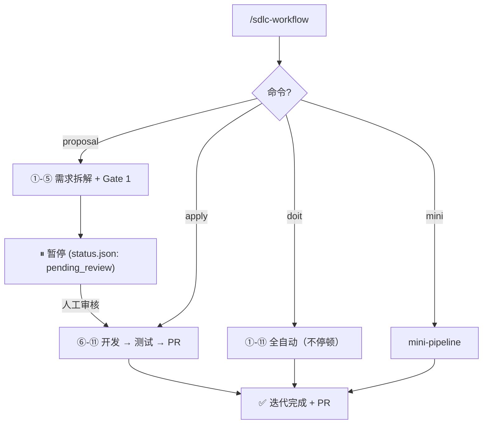

# SDLC Workflow Suite — AI 驱动的自动化开发流水线

基于 Claude Code Skills、Codex CLI 审查门禁和浏览器 MCP 验收构建的可编排 SDLC 工作流。

当前推荐入口是单入口多模式：

- `/sdlc-workflow init ...`
- `/sdlc-workflow proposal ...` — 需求拆解，等待人工审核
- `/sdlc-workflow apply ...` — 审核通过后执行开发
- `/sdlc-workflow doit ...` — 全自动模式
- `/sdlc-workflow mini ...` — 小任务轻量流程

**单 Agent 模式** + **双模型把关**（Claude Code 生成 / Codex CLI 审查）

默认面向 Better-T-Stack 风格的全栈目录约定：

- `apps/web`：Web 前端
- `apps/server`：后端 API / BFF / Worker
- `packages/config`：基础配置
- `packages/env|api|auth|db|infra|ui`：按所选能力启用的共享模块

该技能会把目录结构纳入设计和审查，避免随意生成根目录级 `web/`、`api/`、`server/`。

---

## 功能特性

- **Proposal / Apply 分离**：需求拆解与开发执行分离，中间可插入人工审核
- **单入口多模式**：init / proposal / apply / doit / mini 分流
- **12 步完整 Pipeline**：从需求到 PR 的全流程自动化
- **双模型审核**：Claude Code 生成 + Codex CLI 独立审查
- **TG 通知**：关键节点实时推送 Telegram 通知
- **自动初始化**：首次运行自动检测并生成项目结构
- **旧项目接入模式**：existing project 先做 baseline intake，再进入需求流程
- **TG_USERNAME 自动检测**：TG/OpenClaw 触发时自动获取用户名
- **iterations 可追溯**：完整保留每次迭代的 requirements/design/tasks

---

## 前置依赖

| 工具 | 用途 | 安装 |
|------|------|------|
| Codex CLI | 双模型审查 (Gate 1 + Gate 2) | `npm i -g @openai/codex` |
| GitHub CLI (gh) | PR 创建 | `brew install gh` → `gh auth login` |
| OpenClaw CLI | TG 通知 | `npm i -g openclaw` |
| Playwright MCP | URL 内容提取 + 浏览器验证 | 已在用户环境配置 |
| CDP (Chrome DevTools Protocol) | 关键交互链路最终复核验证 | chrome-cdp skill（`~/.claude/skills/chrome-cdp`） |

---

## 安装

### 方式 1: skills CLI（推荐）

```bash
npx skills add evan-taojiangcb/sdlc-workflow -g -y
```

### 方式 2: git clone

```bash
git clone https://github.com/evan-taojiangcb/sdlc-workflow ~/.agents/skills/sdlc-workflow
```

---

## 快速开始

### 首次使用

```bash
# 初始化项目
/sdlc-workflow init

# 需求拆解（推荐流程）
/sdlc-workflow proposal 创建一个用户登录模块

# 审阅 proposal 产物:
#   docs/iterations/2026-04-13/001-user-login-feature/
#   ├── requirements.md
#   ├── design.md
#   ├── tasks.md
#   └── status.json (phase: pending_review)

# 审核通过后执行开发
/sdlc-workflow apply docs/iterations/2026-04-13/001-user-login-feature/

# 或者使用全自动模式（不停顿）
/sdlc-workflow doit 创建一个用户登录模块

# 小任务
/sdlc-workflow mini 把首页背景改成红色
```

自动流程：
1. 识别是 fresh project 还是 existing project
2. 检测项目未初始化 → 执行 `init-project.sh` → 生成 `.claude/` + `docs/` + `tests/` + `.env.example`
3. 若为 existing project → 先生成 `.claude/PROJECT_BASELINE.md`、`.claude/EXISTING_STRUCTURE.md`、`.claude/TEST_BASELINE.md`
4. 检测 TG_USERNAME：
   - 若 TG 触发且存在 `OPENCLAW_TRIGGER_USER` → 自动创建 `.env`（若缺失）并写入
   - 若手动触发 → 提示用户 `cp .env.example .env` → 编辑 `.env` 设置 `TG_USERNAME`
5. 配置完成后 → 进入 Pipeline

### 接入已存在项目

如果项目已经存在技术架构和业务代码，workflow 不会把它当 fresh project 重建目录，而是先进入 existing project intake：

1. 盘点现有 workspace、脚本、测试和环境依赖
2. 生成：
   - `.claude/PROJECT_BASELINE.md`
   - `.claude/EXISTING_STRUCTURE.md`
   - `.claude/TEST_BASELINE.md`
3. 后续 requirements / design / tasks 必须基于 baseline，而不是自由发挥重构原项目

### 后续使用

```bash
# Proposal → 审核 → Apply（推荐）
/sdlc-workflow proposal 添加密码重置功能
# ... 审阅产物 ...
/sdlc-workflow apply   # 自动定位最近的 pending proposal

# 全自动模式
/sdlc-workflow doit 添加密码重置功能
/sdlc-workflow doit file:///path/to/requirements.txt
/sdlc-workflow doit https://jira.company.com/browse/PROJ-123

# 小任务
/sdlc-workflow mini 调整首页 Hero 文案
```

---

## 命令入口

### `/sdlc-workflow init`

用于初始化或接入 existing project。

### `/sdlc-workflow proposal`

需求拆解命令（参考 OpenSpec 模式）。执行步骤 ①-⑤（需求采集 → 澄清 → 设计 → 任务分解 → Gate 1），产出 proposal 产物后暂停，等待人工审核。

产出物：
- `requirements.md` — 结构化需求
- `design.md` — 技术设计
- `tasks.md` — 任务分解
- `status.json` — 状态标记 (`pending_review`)

### `/sdlc-workflow apply`

需求开发命令。在 proposal 产物经人工审核后，继续执行步骤 ⑥-⑪（开发 → 测试 → Gate 2 → 测试流水线 → 文档 → PR）。

### `/sdlc-workflow doit`

全自动模式。内部等价于 `proposal + apply` 不停顿，适用于完全信任 AI 处理的场景。

### `/sdlc-workflow mini`

用于微小任务，最终验收仍基于 Playwright MCP + CDP。
它不会跳过 gate；mini 模式仍需执行精简版 Gate 1、验证能力检测、Gate 2 和最终 MCP 验收。

---

## Pipeline 流程



---

## 项目结构

```
├── SKILL.md                    # 入口（Pipeline 编排）
├── references/                 # 共享步骤规范
│   ├── pipeline-overview.md
│   ├── proposal.md             # 需求拆解命令
│   ├── apply.md                # 需求开发命令
│   ├── existing-project-intake.md
│   ├── micro-change-mode.md
│   ├── requirements-ingestion.md
│   ├── requirements-clarifier.md
│   ├── design-generator.md
│   ├── task-generator.md
│   ├── design-reviewer.md
│   ├── test-generator.md
│   ├── code-reviewer.md
│   ├── test-pipeline.md
│   ├── docs-updater.md
│   ├── git-committer.md
│   └── tg-notifier.md
├── templates/                  # 项目初始化模板
│   ├── CLAUDE.md.tpl
│   ├── workflow-rules.md.tpl
│   ├── ARCHITECTURE.md.tpl
│   ├── SECURITY.md.tpl
│   ├── CODING_GUIDELINES.md.tpl
│   └── env.example.tpl
├── scripts/
│   ├── init-project.sh        # 项目初始化脚本
│   └── update-workflow-config.sh
└── README.md
```

### 目标项目结构（init 后生成）

```
your-project/
├── .claude/                    # Claude 上下文（统一放置）
│   ├── CLAUDE.md
│   ├── ARCHITECTURE.md
│   ├── SECURITY.md
│   ├── CODING_GUIDELINES.md
│   ├── PROJECT_BASELINE.md     # existing project
│   ├── EXISTING_STRUCTURE.md
│   ├── TEST_BASELINE.md
│   └── rules/
│       └── workflow-rules.md
├── docs/                       # 迭代产物
│   └── iterations/
│       └── YYYY-MM-DD/
│           └── <seq>-<slug>-<type>/
│               ├── requirements.md
│               ├── design.md
│               ├── tasks.md
│               └── status.json
├── tests/
│   ├── unit/
│   ├── e2e/
│   └── reports/
├── .env
└── .env.example
```

---

## 配置

`.env` 文件配置：

```bash
# 必需
TG_USERNAME=your_telegram_username

# 可选（默认值）
TEST_FRAMEWORK=jest        # jest | vitest | mocha
E2E_FRAMEWORK=playwright   # 固定使用 Playwright，配合 Playwright MCP + CDP
LINT_TOOL=eslint           # eslint | biome
REVIEW_MAX_ROUNDS=1        # 1-10
GIT_BRANCH_PREFIX=feat/    # 分支前缀
```

---

## 迭代目录结构

每次迭代产物：

```
docs/iterations/YYYY-MM-DD/<seq>-<slug>-<type>/
├── requirements.md    # 结构化需求
├── design.md          # 技术设计
├── tasks.md           # 任务分解
└── status.json        # proposal/apply 状态
```

其中 `<seq>` 为当日顺序号，从 `001` 开始递增，保证同一天多个需求按执行顺序可追踪。

### status.json

```json
{
  "phase": "pending_review | approved | rejected | applied",
  "proposal_at": "2026-04-13T14:00:00+08:00",
  "reviewed_at": null,
  "applied_at": null,
  "iter_dir": "docs/iterations/2026-04-13/001-user-login-feature/"
}
```

---

## 更新技能

```bash
npx skills update
# 或
cd ~/.agents/skills/sdlc-workflow && git pull
```

---

## License

MIT
