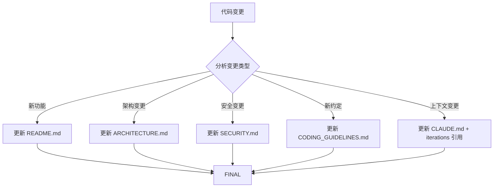

# 步骤 ⑩: Docs Updater — 文档更新

## 输入

1. 代码变更
2. 本次迭代产物（requirements.md, design.md, tasks.md）

## 输出

更新后的文档

## 详细行为

### 1. 文档更新策略



### 2. README.md 更新

新增功能说明添加到 README.md：

```bash
# 检测新增 API/模块
NEW_APIS=$(git diff --name-only | grep -E "^(apps/server/src/|packages/.*/src/)" || echo "")
NEW_FEATURES=$(git diff --name-only | grep -E "^(apps/web/src/|apps/native/src/|packages/.*/src/)" || echo "")

if [ -n "$NEW_APIS" ]; then
  echo "## 新增 API

### 认证 API

| 方法 | 路径 | 说明 |
|------|------|------|
| POST | /api/auth/login | 用户登录 |
| POST | /api/auth/logout | 用户登出 |

" >> README.md
fi
```

### 3. ARCHITECTURE.md 更新

架构层面变更时更新：

```bash
# 检测架构文件变更
ARCH_CHANGES=$(git diff docs/ARCHITECTURE.md)

if [ -n "$ARCH_CHANGES" ]; then
  # 添加架构变更记录
  cat >> docs/ARCHITECTURE.md << 'EOF'

## 架构变更记录

### YYYY-MM-DD: <变更摘要>

**变更类型**: <新增/修改/重构>

**变更内容**:
<详细描述>

**影响范围**:
<受影响的模块>

**决策理由**:
<为什么做此变更>
EOF
fi
```

### 4. SECURITY.md 更新

安全相关变更时更新：

```bash
# 检测安全相关变更
SEC_CHANGES=$(git diff --name-only | grep -E "(auth|security|token|encrypt)" || echo "")

if [ -n "$SEC_CHANGES" ]; then
  cat >> docs/SECURITY.md << 'EOF'

## 安全更新记录

### YYYY-MM-DD: <安全变更摘要>

**变更类型**: <新增/修改/修复>

**安全考量**:
<详细描述>

**实施措施**:
<采取的安全措施>
EOF
fi
```

### 5. CODING_GUIDELINES.md 更新

新模式/约定时更新：

```bash
# 检测新增模式
NEW_PATTERNS=$(git diff --name-only | grep -E "(pattern|strategy|convention)" || echo "")

if [ -n "$NEW_PATTERNS" ]; then
  cat >> docs/CODING_GUIDELINES.md << 'EOF'

## 编码约定更新

### YYYY-MM-DD: <约定摘要>

**新增约定**:
<新的编码约定>

**示例**:
\`\`\`typescript
// 示例代码
\`\`\`
EOF
fi
```

### 6. CLAUDE.md 更新（含 iterations 引用）

**关键**：更新 iterations 引用列表，使 Claude 可读取历史上下文：

```bash
# 更新 CLAUDE.md 的 iterations 引用章节
ITER_DATE=$(date +%Y-%m-%d)
ITER_DIR="docs/iterations/$ITER_DATE/${SLUG}-${TYPE}/"

# 检查是否已有 iterations 章节
if ! grep -q "## 迭代历史" .claude/CLAUDE.md; then
  # 添加 iterations 章节
  cat >> .claude/CLAUDE.md << 'EOF'

## 迭代历史

历史迭代记录存放在 `docs/iterations/` 目录下：

EOF
fi

# 更新 iterations 引用（添加到最前面）
sed -i '' "s|## 迭代历史|## 迭代历史\n\n- [$ITER_DATE] $SLUG ($TYPE): $(head -c 50 requirements.md)...\n|" .claude/CLAUDE.md
```

### 7. 完整更新流程

```bash
#!/bin/bash
set -euo pipefail

ITER_DIR="docs/iterations/$DATE/${SLUG}-${TYPE}/"

# 1. 分析代码变更
echo "📊 分析代码变更..."

# 2. 更新 README.md（新增功能）
if git diff --name-only | grep -qE "^(apps/|packages/)"; then
  update_readme
fi

# 3. 更新 ARCHITECTURE.md（架构变更）
if [ -f "$ITER_DIR/design.md" ]; then
  update_architecture
fi

# 4. 更新 SECURITY.md（安全相关）
if git diff --name-only | grep -qiE "(auth|security|token|encrypt)"; then
  update_security
fi

# 5. 更新 CODING_GUIDELINES.md（新约定）
if git diff --name-only | grep -qE "(pattern|strategy)"; then
  update_coding_guidelines
fi

# 6. 更新 CLAUDE.md（iterations 引用）
update_claude_md

echo "✅ 文档更新完成"
```

### 8. 目录结构同步

若本次迭代改动了 workspace 边界，应同步更新 `docs/ARCHITECTURE.md`：

- 新增或移除了 `apps/*`
- 新增了 `packages/*`
- 调整了共享模块归属
- 记录为何没有沿用 Better-T-Stack 默认目录

## 命令模板

```bash
#!/bin/bash
set -euo pipefail

ITER_DIR="docs/iterations/$DATE/${SLUG}-${TYPE}/"
ITER_DATE=$(date +%Y-%m-%d)

# 1. README.md 更新
cat >> README.md << 'EOF'

## 更新日志

### YYYY-MM-DD: <功能名称>

<功能描述>
EOF

# 2. ARCHITECTURE.md 更新（如有架构变更）
if [ -f "$ITER_DIR/design.md" ]; then
  # 提取设计变更并合并到架构文档
  merge_design_to_architecture
fi

# 3. SECURITY.md 更新（如有安全变更）
if git diff --name-only | grep -qiE "(auth|security)"; then
  append_security_changes
fi

# 4. CODING_GUIDELINES.md 更新（如有新约定）
if git diff --name-only | grep -qE "pattern"; then
  append_coding_conventions
fi

# 5. CLAUDE.md iterations 引用更新
update_iterations_reference() {
  local iter_link="- [$ITER_DATE] $SLUG ($TYPE): $(head -c 50 $ITER_DIR/requirements.md)..."

  # 插入到 ## 迭代历史 章节下
  if grep -q "## 迭代历史" .claude/CLAUDE.md; then
    # 在迭代历史章节添加新条目（最新在前）
    sed -i "/## 迭代历史/a\\$iter_link" .claude/CLAUDE.md
  else
    echo "⚠️ CLAUDE.md 缺少 ## 迭代历史 章节"
  fi
}
update_iterations_reference

echo "✅ 文档更新完成"
```

## 错误处理

| 错误场景 | 处理方式 |
|----------|----------|
| README.md 不存在 | 跳过，或创建基础版本 |
| CLAUDE.md 缺少章节 | 自动添加 iterations 章节 |
| 文档合并冲突 | 保留双方内容，标记待人工解决 |

## TG 通知文案

文档更新完成后：

```
📝 文档已更新:
📄 README.md
📄 docs/ARCHITECTURE.md
📄 docs/SECURITY.md
📄 docs/CODING_GUIDELINES.md
📄 .claude/CLAUDE.md (iterations 引用已更新)
```

## 相关文件

- 输入：
  - 代码变更（git diff）
  - docs/iterations/YYYY-MM-DD/<slug>-<type>/requirements.md
  - docs/iterations/YYYY-MM-DD/<slug>-<type>/design.md
  - docs/iterations/YYYY-MM-DD/<slug>-<type>/tasks.md
- 输出：更新后的文档
- 参考：
  - references/git-committer.md（下一步）
