# Pipeline 概览：完整 12 步 SDLC 自动化流程

## 1. 流程图

```mermaid
graph TD
    START["/sdlc-workflow <input>"] --> CMD{命令类型?}
    CMD -->|init| INIT_RUN["运行 init-project.sh"]
    CMD -->|proposal| PROPOSAL_FLOW
    CMD -->|apply| APPLY_FLOW
    CMD -->|doit| DOIT_FLOW
    CMD -->|mini| MINI_FLOW["mini-pipeline"]

    subgraph PROPOSAL_FLOW [proposal 流程]
      P_INIT{项目已初始化?}
      P_INIT -->|否| P_INIT_RUN["运行 init-project.sh"]
      P_INIT_RUN --> P_MODE{"fresh 还是 existing?"}
      P_INIT -->|是| P_MODE

      P_MODE -->|fresh| P_TG_DETECT
      P_MODE -->|existing| P_INTAKE["existing-project-intake<br/>→ PROJECT_BASELINE / EXISTING_STRUCTURE / TEST_BASELINE"]
      P_INTAKE --> P_TG_DETECT

      P_TG_DETECT["TG_USERNAME 自动检测<br/>OPENCLAW_TRIGGER_USER → .env"]
      P_TG_DETECT --> P_ENV_CHECK{".env 配置完整?"}
      P_ENV_CHECK -->|缺 TG_USERNAME| P_STOP["⏸ 提示用户配置 .env"]
      P_ENV_CHECK -->|完整| P_SLUG["生成迭代目录<br/>docs/iterations/YYYY-MM-DD/001-slug-type/"]

      P_SLUG --> P_ROUTE{输入类型路由}
      P_ROUTE -->|文本| P_C1[直接解析]
      P_ROUTE -->|"file://"| P_C2[读取文件]
      P_ROUTE -->|URL| P_C3["Playwright MCP 提取"]

      P_C1 --> P_S1
      P_C2 --> P_S1
      P_C3 --> P_S1

      P_S1["① requirements-ingestion<br/>→ requirements.md"] --> P_TG1["📱 TG: 需求已收录"]
      P_TG1 --> P_S2["② requirements-clarifier<br/>混合模式澄清"]
      P_S2 -->|低置信度问题| P_TG2["📱 TG: 需确认问题"]
      P_S2 --> P_S3["③ design-generator<br/>→ design.md"]
      P_S3 --> P_S4["④ task-generator<br/>→ tasks.md"]

      P_S4 --> P_S5["⑤ design-reviewer · Gate 1<br/>Codex CLI 审查设计"]
      P_S5 --> P_TG3["📱 TG: 设计 Review 结果"]
      P_TG3 -->|FAIL & round ≤ N| P_S3
      P_TG3 -->|PASS 经修订| P_S5_1["⑤.1 增量文档同步<br/>ARCHITECTURE / SECURITY"]
      P_TG3 -->|PASS 首轮通过| P_STATUS
      P_TG3 -->|"FAIL & round > N"| P_ESCALATE["📱 TG: ⚠️ 需人工介入 → 中止"]
      P_S5_1 --> P_STATUS

      P_STATUS["写入 status.json<br/>phase: pending_review"]
      P_STATUS --> P_NOTIFY["📱 TG: 📋 需求拆解完成<br/>等待人工审核"]
      P_NOTIFY --> P_END["⏸ 暂停，等待 apply"]
    end

    subgraph APPLY_FLOW [apply 流程]
      A_CHECK["读取 status.json<br/>校验 phase"]
      A_CHECK -->|approved / pending_review| A_S6_DEP["⑥.1 依赖分析 + 拓扑分层"]
      A_CHECK -->|rejected / applied| A_ABORT["❌ 中止"]

      A_S6_DEP --> A_S6_MODE{"并行层 > 1 且任务 ≥ 3?"}
      A_S6_MODE -->|是| A_S6_TEAM["⑥.3b Agent Team 并行<br/>按层分发子 Agent"]
      A_S6_MODE -->|否| A_S6_SEQ["⑥.3a 顺序逐任务开发"]
      A_S6_TEAM --> A_S6["⑥.4 tasks.md 回写"]
      A_S6_SEQ --> A_S6["⑥.4 tasks.md 回写"]

      A_S6 --> A_S7["⑦ test-generator<br/>→ tests/unit/ + tests/e2e/"]
      A_S7 --> A_S8["⑧ code-reviewer · Gate 2<br/>Codex CLI 审查代码"]
      A_S8 --> A_TG4["📱 TG: Code Review 结果"]
      A_TG4 -->|FAIL & round ≤ N| A_S6
      A_TG4 -->|PASS| A_S9["⑨ test-pipeline<br/>lint → unit → Playwright → MCP → CDP"]
      A_TG4 -->|"FAIL & round > N"| A_ESCALATE["📱 TG: ⚠️ 需人工介入"]

      A_S9 --> A_TG5["📱 TG: 测试报告"]
      A_TG5 -->|失败 & round ≤ N| A_S9_1{"修复涉及<br/>design/tasks 变更?"}
      A_S9_1 -->|是| A_S9_SYNC["⑨.1 增量文档同步"] --> A_S6
      A_S9_1 -->|否| A_S6
      A_TG5 -->|全部通过| A_S10["⑩ docs-updater<br/>更新文档"]
      A_TG5 -->|"失败 & round > N"| A_ESCALATE

      A_S10 --> A_S11["⑪ git-committer<br/>branch → commit → push → PR"]
      A_S11 --> A_STATUS["更新 status.json<br/>phase: applied"]
      A_STATUS --> A_TG7["📱 TG: ✅ 迭代完成 + PR 链接"]
    end

    subgraph DOIT_FLOW [doit 全自动流程]
      D_NOTE["内部执行 proposal + apply<br/>不暂停，不等待人工审核"]
    end
```



## 2. 命令入口映射

| 命令 | 说明 | 执行范围 | 暂停点 |
|------|------|----------|--------|
| `init` | 初始化项目 | ⓪ | — |
| `proposal` | 需求拆解 | ①②③④⑤ | Gate 1 后暂停，写入 status.json |
| `apply` | 需求开发 | ⑥⑦⑧⑨⑩⑪ | 读取 status.json 后继续 |
| `doit` | 全自动（proposal + apply） | ①-⑪ | 不暂停 |
| `mini` | 小任务轻量流程 | 参见 mini-pipeline.md | — |

## 3. 步骤详解表

| 步骤 | 名称 | Pattern | 输入 | 输出 | 工具 | 命令归属 |
|------|------|---------|------|------|------|----------|
| ⓪ | 初始化 + 模式识别 | — | 项目目录 | 初始化结构 + existing baseline | init-project.sh + existing-project-intake | proposal/doit |
| ① | requirements-ingestion | Router + Tool Wrapper | 文本/file/URL | requirements.md | Read + Playwright MCP | proposal/doit |
| ② | requirements-clarifier | Evaluator | requirements.md | requirements.md (标注版) | Claude Code 内置 | proposal/doit |
| ③ | design-generator | Generator | requirements.md + .claude/ARCHITECTURE.md + .claude/SECURITY.md + 历史 | design.md | Claude Code | proposal/doit |
| ④ | task-generator | Generator | design.md | tasks.md | Claude Code | proposal/doit |
| ⑤ | design-reviewer | Evaluator-Optimizer | design.md + tasks.md + .claude/ARCHITECTURE.md + .claude/SECURITY.md | PASS/FAIL | Codex CLI | proposal/doit |
| ⑤.1 | 增量文档同步 | Tool Wrapper | design.md 修订 diff | 更新后的 ARCHITECTURE/SECURITY | Claude Code | proposal/doit |
| — | **status.json 写入** | — | proposal 摘要 | status.json (pending_review) | — | **仅 proposal** |
| ⑥ | Claude Code 开发 | Orchestrator-Workers | tasks.md（依赖分析→拓扑分层） | 代码变更 | Claude Code + Agent Team（并行层） | apply/doit |
| ⑦ | test-generator | Generator | tasks.md + git diff | tests/unit/ + tests/e2e/ | Claude Code | apply/doit |
| ⑧ | code-reviewer | Evaluator-Optimizer | git diff + .claude/CODING_GUIDELINES.md + .claude/SECURITY.md | PASS/FAIL | Codex CLI | apply/doit |
| ⑨ | test-pipeline | Pipeline | tests/ | tests/reports/ | Lint + Playwright 预检 + Playwright MCP + CDP 最终验收 | apply/doit |
| ⑨.1 | 测试修复文档同步 | Tool Wrapper | design.md/tasks.md 修复 diff | 更新后的 ARCHITECTURE/SECURITY | Claude Code | apply/doit |
| ⑩ | docs-updater | Tool Wrapper | 代码变更 + 迭代产物 | 更新后的文档 | Claude Code | apply/doit |
| ⑪ | git-committer | Tool Wrapper | 所有变更 | PR URL | Git + GitHub CLI | apply/doit |
| ⑫ | 最终通知 | — | PR URL + 变更摘要 | TG 消息 | OpenClaw CLI | apply/doit |

## 4. Google Cloud 5 Agent Pattern 映射

| Pattern | 体现 |
|---------|------|
| **Sequential Chain** | 主 Pipeline 12 步顺序执行 |
| **Routing** | 步骤① 根据输入类型（文本/文件/URL）路由到不同提取策略 |
| **Parallelization** | 步骤⑥ Agent Team 按拓扑层并行开发；步骤⑨ 内 Stage 2 + Stage 3 可并行执行 |
| **Orchestrator-Workers** | SKILL.md = Orchestrator；12 个 reference = Workers |
| **Evaluator-Optimizer** | design-reviewer + code-reviewer + test-pipeline 三处评估-优化循环 |

对 existing project，还增加一个前置基线模式：

- existing-project-intake：先确认现有结构和约束，再允许进入需求与设计

## 5. 双模型把关架构

```
Claude Code (生成)                  Codex CLI (审查)
━━━━━━━━━━━━━━━━━                  ━━━━━━━━━━━━━━━━
design.md + tasks.md  ──────→  🔍 Gate 1: design-reviewer
                                (可行性/安全/架构/完整性)
                                     ├─ PASS → proposal 暂停 / doit 继续开发
                                     └─ FAIL → Claude Code 修订 → 重审 (≤N轮)

git diff (代码变更)   ──────→  🔍 Gate 2: code-reviewer
                                (质量/安全漏洞/编码规范)
                                     ├─ PASS → 进入测试
                                     └─ FAIL → Claude Code 修复 → 重审 (≤N轮)
```

## 6. 两层架构

```
┌─────────────────────────────────────────────────────────┐
│  用户级（安装一次，永久可用）                               │
│  ~/.agents/skills/sdlc-workflow/                         │
│  ├── SKILL.md                                           │
│  ├── references/       ← 14 个步骤详细规范               │
│  │   ├── proposal.md   ← 需求拆解命令                    │
│  │   ├── apply.md      ← 需求开发命令                    │
│  │   └── ...           ← 其余 12 个步骤规范              │
│  ├── templates/        ← 6 个项目初始化模板               │
│  └── scripts/          ← init-project.sh                │
└──────────────────────┬──────────────────────────────────┘
                       │ 首次运行 /sdlc-workflow 时自动生成 ↓
┌──────────────────────▼──────────────────────────────────┐
│  项目级（每个项目独立，从模板生成）                          │
│  your-project/                                          │
│  ├── .claude/                                           │
│  │   ├── CLAUDE.md                                      │
│  │   ├── ARCHITECTURE.md                                │
│  │   ├── SECURITY.md                                    │
│  │   ├── CODING_GUIDELINES.md                           │
│  │   ├── PROJECT_BASELINE.md    ← existing project       │
│  │   ├── EXISTING_STRUCTURE.md                           │
│  │   ├── TEST_BASELINE.md                                │
│  │   └── rules/                                         │
│  │       └── workflow-rules.md                           │
│  ├── docs/                                              │
│  │   └── iterations/                                    │
│  │       └── YYYY-MM-DD/                                │
│  │           └── <seq>-<slug>-<type>/                   │
│  │               ├── requirements.md                     │
│  │               ├── design.md                           │
│  │               ├── tasks.md                            │
│  │               └── status.json                         │
│  ├── apps/                                               │
│  │   ├── web/                                            │
│  │   ├── server/                                         │
│  │   └── native/                                         │
│  ├── packages/                                           │
│  │   ├── config/                                         │
│  │   ├── env/                                            │
│  │   ├── api/                                            │
│  │   ├── auth/                                           │
│  │   ├── db/                                             │
│  │   ├── infra/                                          │
│  │   └── ui/                                             │
│  ├── tests/                                              │
│  │   ├── unit/web/                                      │
│  │   ├── unit/server/                                   │
│  │   ├── unit/packages/                                 │
│  │   ├── e2e/                                           │
│  │   └── reports/playwright/                                │
│  ├── .env                                               │
│  └── .env.example                                       │
└─────────────────────────────────────────────────────────┘
```

## 7. 关键设计决策

### 7.0 Existing Project Intake
- existing project 不能被当成 fresh project 直接套模板
- existing project mode 必须先产出：
  - `.claude/PROJECT_BASELINE.md`
  - `.claude/EXISTING_STRUCTURE.md`
  - `.claude/TEST_BASELINE.md`
- 后续 requirements / design / tasks 必须基于 intake 结论，而不是模型猜测
- 只有在 `design.md` 明确批准时，才允许调整既有技术架构

### 7.1 统一测试目录
- 取消 `specs/` 目录，v6 中 specs/ 和 tests/ 职责重叠
- v7 统一为 `tests/`
- v8 进一步要求单元测试镜像 workspace 目录，不得写回源码目录
- 测试报告统一写入 `tests/reports/`，其中浏览器验证证据写入 `tests/reports/playwright/` 与 `tests/reports/cdp/`

### 7.2 迭代目录命名
- v6 扁平 `YYYY-MM-DD/` 结构导致同日多需求冲突
- v7 改为 `YYYY-MM-DD/<slug>-<type>/` 支持同日多需求并行
- v8 再补 `<seq>`，形成 `YYYY-MM-DD/<seq>-<slug>-<type>/`，显式记录同日执行顺序

### 7.3 CLAUDE.md 引入 iterations
- 使 Claude 在后续交互中可自动读取历史迭代上下文
- 避免重复设计和冲突方案

### 7.4 TG_USERNAME 自动检测
- TG/OpenClaw 触发场景下从 `OPENCLAW_TRIGGER_USER` 自动获取
- 免去手动配置步骤

### 7.5 全栈目录约束
- 默认遵循 Better-T-Stack 风格 monorepo：`apps/web`、`apps/server`、`packages/*`
- Web 代码默认进入 `apps/web/src/`
- 后端代码默认进入 `apps/server/src/`
- `packages/config` 始终存在；`packages/env`、`api`、`auth`、`db`、`infra`、`ui` 按所选能力启用
- 共享逻辑默认进入 `packages/*`
- 默认不接受新增根目录级 `web/`、`api/`、`server/`

### 7.6 Proposal / Apply 分离
- 参考 OpenSpec 模式，将需求拆解与需求开发分离
- `proposal` 产出 requirements.md + design.md + tasks.md + status.json
- 中间插入人工审核环节，避免 AI 自行决定所有设计决策
- `apply` 从审核通过的 proposal 产物继续执行开发
- `doit` 保留为全自动模式（内部自动完成 proposal + apply）

### 7.7 文档放置
- ARCHITECTURE.md、SECURITY.md、CODING_GUIDELINES.md 与 CLAUDE.md 统一放在 `.claude/` 目录
- `docs/` 目录仅保留迭代产物和 existing project baseline
- 减少文件分散，使 Claude 上下文加载更集中

## 8. 环境变量配置

所有配置通过项目 `.env` 文件管理：

| 变量 | 默认值 | 说明 |
|------|--------|------|
| TG_USERNAME | (必需) | Telegram 用户名 |
| TEST_FRAMEWORK | jest | 单元测试框架 |
| E2E_FRAMEWORK | playwright | 固定 E2E 测试框架 |
| LINT_TOOL | eslint | Lint 工具 |
| REVIEW_MAX_ROUNDS | 1 | 审查最大轮数 |
| GIT_BRANCH_PREFIX | feat/ | Git 分支前缀 |
| COMMIT_SCOPE | (空) | Commit scope |
