# Pipeline 概览：完整 12 步 SDLC 自动化流程

## 1. 流程图

```mermaid
graph TD
    START["/sdlc-workflow <input>"] --> INIT{项目已初始化?}
    INIT -->|否| INIT_RUN["运行 init-project.sh"]
    INIT_RUN --> MODE{"fresh 还是 existing?"}
    INIT -->|是| MODE

    MODE -->|fresh| TG_DETECT
    MODE -->|existing| INTAKE["existing-project-intake<br/>→ PROJECT_BASELINE / EXISTING_STRUCTURE / TEST_BASELINE"]
    INTAKE --> TG_DETECT

    TG_DETECT["TG_USERNAME 自动检测<br/>OPENCLAW_TRIGGER_USER → .env"]
    TG_DETECT --> ENV_CHECK{".env 配置完整?"}
    ENV_CHECK -->|缺 TG_USERNAME| STOP["⏸ 提示用户配置 .env"]
    ENV_CHECK -->|完整| SLUG["生成迭代目录<br/>docs/iterations/YYYY-MM-DD/001-slug-type/"]

    SLUG --> ROUTE{输入类型路由}
    ROUTE -->|文本| C1[直接解析]
    ROUTE -->|"file://"| C2[读取文件]
    ROUTE -->|URL| C3["Chrome DevTools MCP 提取"]

    C1 --> S1
    C2 --> S1
    C3 --> S1

    S1["① requirements-ingestion<br/>→ requirements.md"] --> TG1["📱 TG: 需求已收录"]
    TG1 --> S2["② requirements-clarifier<br/>混合模式澄清"]
    S2 -->|低置信度问题| TG2["📱 TG: 需确认问题"]
    S2 --> S3["③ design-generator<br/>→ design.md"]
    S3 --> S4["④ task-generator<br/>→ tasks.md"]

    S4 --> S5["⑤ design-reviewer · Gate 1<br/>Codex CLI 审查设计"]
    S5 --> TG3["📱 TG: 设计 Review 结果"]
    TG3 -->|FAIL & round ≤ N| S3
    TG3 -->|PASS 经修订| S5_1["⑤.1 增量文档同步<br/>ARCHITECTURE / SECURITY / EXISTING_STRUCTURE"]
    TG3 -->|PASS 首轮通过| S6["⑥ Claude Code 按 tasks.md 开发"]
    TG3 -->|"FAIL & round > N"| ESCALATE["📱 TG: ⚠️ 需人工介入 → 中止"]
    S5_1 --> S6

    S6 --> S7["⑦ test-generator<br/>→ tests/unit/ + tests/e2e/"]
    S7 --> S8["⑧ code-reviewer · Gate 2<br/>Codex CLI 审查代码"]
    S8 --> TG4["📱 TG: Code Review 结果"]
    TG4 -->|FAIL & round ≤ N| S6
    TG4 -->|PASS| S9["⑨ test-pipeline<br/>lint → unit → Playwright 预检 → Chrome MCP + WebMCP 最终交互测试"]
    TG4 -->|"FAIL & round > N"| ESCALATE

    S9 --> TG5["📱 TG: 测试报告"]
    TG5 -->|失败 & round ≤ N| S9_1{"修复涉及<br/>design/tasks 变更?"}
    S9_1 -->|是| S9_SYNC["⑨.1 增量文档同步<br/>ARCHITECTURE / SECURITY"] --> S6
    S9_1 -->|否| S6
    TG5 -->|全部通过| S10["⑩ docs-updater<br/>更新文档"]
    TG5 -->|"失败 & round > N"| ESCALATE

    S10 --> S11["⑪ git-committer<br/>branch → commit → push → PR"]
    S11 --> TG7["📱 TG: ✅ 迭代完成 + PR 链接"]
```



## 2. 步骤详解表

| 步骤 | 名称 | Pattern | 输入 | 输出 | 工具 |
|------|------|---------|------|------|------|
| ⓪ | 初始化 + 模式识别 | — | 项目目录 | 初始化结构 + existing baseline | init-project.sh + existing-project-intake |
| ① | requirements-ingestion | Router + Tool Wrapper | 文本/file/URL | requirements.md | Read + Chrome DevTools MCP |
| ② | requirements-clarifier | Evaluator | requirements.md | requirements.md (标注版) | Claude Code 内置 |
| ③ | design-generator | Generator | requirements.md + ARCHITECTURE.md + SECURITY.md + 历史 | design.md | Claude Code |
| ④ | task-generator | Generator | design.md | tasks.md | Claude Code |
| ⑤ | design-reviewer | Evaluator-Optimizer | design.md + tasks.md + ARCHITECTURE.md + SECURITY.md | PASS/FAIL | Codex CLI |
| ⑤.1 | 增量文档同步 | Tool Wrapper | design.md 修订 diff | 更新后的 ARCHITECTURE/SECURITY/EXISTING_STRUCTURE | Claude Code |
| ⑥ | Claude Code 开发 | — | tasks.md | 代码变更 | Claude Code |
| ⑦ | test-generator | Generator | tasks.md + git diff | tests/unit/ + tests/e2e/ | Claude Code |
| ⑧ | code-reviewer | Evaluator-Optimizer | git diff + CODING_GUIDELINES.md + SECURITY.md | PASS/FAIL | Codex CLI |
| ⑨ | test-pipeline | Pipeline | tests/ | tests/reports/ | Lint + Playwright 预检 + Chrome DevTools MCP + WebMCP 最终验收 |
| ⑨.1 | 测试修复文档同步 | Tool Wrapper | design.md/tasks.md 修复 diff | 更新后的 ARCHITECTURE/SECURITY | Claude Code |
| ⑩ | docs-updater | Tool Wrapper | 代码变更 + 迭代产物 | 更新后的文档 | Claude Code |
| ⑪ | git-committer | Tool Wrapper | 所有变更 | PR URL | Git + GitHub CLI |
| ⑫ | 最终通知 | — | PR URL + 变更摘要 | TG 消息 | OpenClaw CLI |

## 3. Google Cloud 5 Agent Pattern 映射

| Pattern | 体现 |
|---------|------|
| **Sequential Chain** | 主 Pipeline 12 步顺序执行 |
| **Routing** | 步骤① 根据输入类型（文本/文件/URL）路由到不同提取策略 |
| **Parallelization** | 步骤⑨ 内 Stage 2 + Stage 3 可并行执行 |
| **Orchestrator-Workers** | SKILL.md = Orchestrator；12 个 reference = Workers |
| **Evaluator-Optimizer** | design-reviewer + code-reviewer + test-pipeline 三处评估-优化循环 |

对 existing project，还增加一个前置基线模式：

- existing-project-intake：先确认现有结构和约束，再允许进入需求与设计

## 4. 双模型把关架构

```
Claude Code (生成)                  Codex CLI (审查)
━━━━━━━━━━━━━━━━━                  ━━━━━━━━━━━━━━━━
design.md + tasks.md  ──────→  🔍 Gate 1: design-reviewer
                                (可行性/安全/架构/完整性)
                                     ├─ PASS → 进入开发
                                     └─ FAIL → Claude Code 修订 → 重审 (≤N轮)

git diff (代码变更)   ──────→  🔍 Gate 2: code-reviewer
                                (质量/安全漏洞/编码规范)
                                     ├─ PASS → 进入测试
                                     └─ FAIL → Claude Code 修复 → 重审 (≤N轮)
```

## 5. 两层架构

```
┌─────────────────────────────────────────────────────────┐
│  用户级（安装一次，永久可用）                               │
│  ~/.agents/skills/sdlc-workflow/                         │
│  ├── SKILL.md                                           │
│  ├── references/       ← 12 个步骤详细规范               │
│  ├── templates/        ← 6 个项目初始化模板               │
│  └── scripts/          ← init-project.sh                │
└──────────────────────┬──────────────────────────────────┘
                       │ 首次运行 /sdlc-workflow 时自动生成 ↓
┌──────────────────────▼──────────────────────────────────┐
│  项目级（每个项目独立，从模板生成）                          │
│  your-project/                                          │
│  ├── .claude/                                           │
│  │   ├── CLAUDE.md                                      │
│  │   └── rules/                                         │
│  │       └── workflow-rules.md                           │
│  ├── docs/                                              │
│  │   ├── ARCHITECTURE.md                                │
│  │   ├── SECURITY.md                                    │
│  │   ├── CODING_GUIDELINES.md                           │
│  │   ├── PROJECT_BASELINE.md                            │
│  │   ├── EXISTING_STRUCTURE.md                          │
│  │   ├── TEST_BASELINE.md                               │
│  │   └── iterations/                                    │
│  │       └── YYYY-MM-DD/                                │
│  │           └── <seq>-<slug>-<type>/                   │
│  │               ├── requirements.md                     │
│  │               ├── design.md                           │
│  │               └── tasks.md                            │
│  ├── apps/                                               │
│  │   ├── web/                                            │
│  │   ├── server/                                         │
│  │   └── native/                                         │
│  ├── packages/                                           │
│  │   ├── config/                                         │
│  │   ├── env/                                            │
│  │   ├── api/                                            │
│  │   ├── auth/                                           │
│  │   ├── db/                                             │
│  │   ├── infra/                                          │
│  │   └── ui/                                             │
│  ├── tests/                                              │
│  │   ├── unit/web/                                      │
│  │   ├── unit/server/                                   │
│  │   ├── unit/packages/                                 │
│  │   ├── e2e/                                           │
│  │   └── reports/chrome/                                │
│  ├── .env                                               │
│  └── .env.example                                       │
└─────────────────────────────────────────────────────────┘
```

## 6. 关键设计决策

### 6.0 Existing Project Intake
- existing project 不能被当成 fresh project 直接套模板
- existing project mode 必须先产出：
  - `docs/PROJECT_BASELINE.md`
  - `docs/EXISTING_STRUCTURE.md`
  - `docs/TEST_BASELINE.md`
- 后续 requirements / design / tasks 必须基于 intake 结论，而不是模型猜测
- 只有在 `design.md` 明确批准时，才允许调整既有技术架构

### 6.1 统一测试目录
- 取消 `specs/` 目录，v6 中 specs/ 和 tests/ 职责重叠
- v7 统一为 `tests/`
- v8 进一步要求单元测试镜像 workspace 目录，不得写回源码目录
- 测试报告统一写入 `tests/reports/`，其中浏览器验证证据写入 `tests/reports/chrome/` 与 `tests/reports/webmcp/`

### 6.2 迭代目录命名
- v6 扁平 `YYYY-MM-DD/` 结构导致同日多需求冲突
- v7 改为 `YYYY-MM-DD/<slug>-<type>/` 支持同日多需求并行
- v8 再补 `<seq>`，形成 `YYYY-MM-DD/<seq>-<slug>-<type>/`，显式记录同日执行顺序

### 6.3 CLAUDE.md 引入 iterations
- 使 Claude 在后续交互中可自动读取历史迭代上下文
- 避免重复设计和冲突方案

### 6.4 TG_USERNAME 自动检测
- TG/OpenClaw 触发场景下从 `OPENCLAW_TRIGGER_USER` 自动获取
- 免去手动配置步骤

### 6.5 全栈目录约束
- 默认遵循 Better-T-Stack 风格 monorepo：`apps/web`、`apps/server`、`packages/*`
- Web 代码默认进入 `apps/web/src/`
- 后端代码默认进入 `apps/server/src/`
- `packages/config` 始终存在；`packages/env`、`api`、`auth`、`db`、`infra`、`ui` 按所选能力启用
- 共享逻辑默认进入 `packages/*`
- 默认不接受新增根目录级 `web/`、`api/`、`server/`

## 7. 环境变量配置

所有配置通过项目 `.env` 文件管理：

| 变量 | 默认值 | 说明 |
|------|--------|------|
| TG_USERNAME | (必需) | Telegram 用户名 |
| TEST_FRAMEWORK | jest | 单元测试框架 |
| E2E_FRAMEWORK | playwright | 固定 E2E 测试框架 |
| LINT_TOOL | eslint | Lint 工具 |
| REVIEW_MAX_ROUNDS | 1 | 审查最大轮数 |
| GIT_BRANCH_PREFIX | feat/ | Git 分支前缀 |
| COMMIT_SCOPE | (空) | Commit scope |
