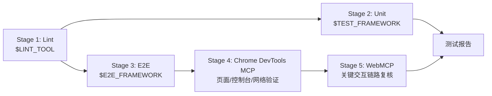

# 步骤 ⑨: Test Pipeline — 测试执行

## 输入

`tests/unit/` 和 `tests/e2e/` 内的测试文件，以及 Chrome DevTools MCP 的验证产物

## 输出

`tests/reports/<slug>-<timestamp>.md` — 测试执行报告  
`tests/reports/chrome/<slug>-<scenario>.md` — Chrome DevTools MCP 验证记录  
`tests/reports/webmcp/<slug>-<scenario>.md` — WebMCP 验证记录

## 详细行为

### 1. 五阶段执行



### 2. Stage 1: Lint

快速失败，代码静态检查：

```bash
# 读取 LINT_TOOL 配置
LINT_TOOL=${LINT_TOOL:-eslint}

case "$LINT_TOOL" in
  eslint)
    echo "🔍 运行 ESLint..."
    npx eslint . --max-warnings 0
    ;;
  biome)
    echo "🔍 运行 Biome..."
    npx biome check . --error-on-warnings
    ;;
  *)
    echo "⚠️ 未知的 LINT_TOOL: $LINT_TOOL"
    ;;
esac
```

### 3. Stage 2: Unit Tests

```bash
# 读取 TEST_FRAMEWORK 配置
TEST_FRAMEWORK=${TEST_FRAMEWORK:-jest}

case "$TEST_FRAMEWORK" in
  jest)
    echo "🧪 运行 Jest 单元测试..."
    npx jest tests/unit/ --coverage --json --outputFile=tests/reports/jest-output.json
    ;;
  vitest)
    echo "🧪 运行 Vitest 单元测试..."
    npx vitest run tests/unit/ --coverage --reporter=json
    ;;
  mocha)
    echo "🧪 运行 Mocha 单元测试..."
    npx mocha tests/unit/ --reporter json > tests/reports/mocha-output.json
    ;;
  *)
    echo "⚠️ 未知的 TEST_FRAMEWORK: $TEST_FRAMEWORK"
    ;;
esac
```

### 4. Stage 3: Playwright 预检

```bash
echo "🎭 运行 Playwright E2E 测试..."
npx playwright test tests/e2e/ --reporter=html,json

if [ -f "playwright-report/index.html" ]; then
  echo "📊 Playwright 测试报告已生成"
fi
```

### 5. Stage 4: Chrome DevTools MCP 最终交互测试

Playwright 预检通过后，必须再用 Chrome DevTools MCP 做一次最终浏览器层交互测试，至少检查：

1. 关键页面可见状态是否符合预期
2. Console 中是否存在未处理错误
3. 关键网络请求是否成功返回
4. 生成独立的 MCP 验证记录，写入 `tests/reports/chrome/`

```bash
echo "🧭 使用 Chrome DevTools MCP 验证关键用户路径..."
# 打开页面 -> 执行动作 -> 获取 snapshot/console/network -> 写入 tests/reports/chrome/<slug>-<scenario>.md
```

### 6. Stage 5: WebMCP 最终交互测试

Chrome DevTools MCP 通过后，必须再用 WebMCP 复核最终关键交互链路，至少检查：

1. 关键表单输入/按钮点击链路
2. 用户可见反馈是否正确
3. 与 Playwright 自动化脚本结果是否一致
4. 生成独立的 WebMCP 验证记录，写入 `tests/reports/webmcp/`

```bash
echo "🌐 使用 WebMCP 复核关键交互链路..."
# 打开页面 -> 执行关键操作 -> 获取可见状态/交互结果 -> 写入 tests/reports/webmcp/<slug>-<scenario>.md
```

### 7. 并行执行

Stage 2 和 Stage 3 可以并行执行（如果无依赖）：

```bash
# 默认串行，只有当 E2E 不依赖 lint/build 产物时才允许并行
PARALLEL_TESTS=${PARALLEL_TESTS:-false}

if [ "$PARALLEL_TESTS" = "true" ]; then
  echo "🚀 并行执行 Unit 和 E2E..."

  run_unit_tests &
  PID_UNIT=$!

  run_e2e_tests &
  PID_E2E=$!

  wait $PID_UNIT || UNIT_EXIT=$?
  wait $PID_E2E || E2E_EXIT=$?

  UNIT_EXIT=${UNIT_EXIT:-0}
  E2E_EXIT=${E2E_EXIT:-0}

  if [ "$UNIT_EXIT" -ne 0 ] || [ "$E2E_EXIT" -ne 0 ]; then
    echo "❌ 部分测试失败"
    exit 1
  fi
else
  run_unit_tests
  run_e2e_tests
fi
```

### 8. 测试报告生成

```bash
# tests/reports/<slug>-<timestamp>.md
TIMESTAMP=$(date +%Y%m%d-%H%M%S)
REPORT_FILE="tests/reports/${SLUG}-${TIMESTAMP}.md"

cat > "$REPORT_FILE" << 'EOF'
# 测试执行报告

## 基本信息

- **执行时间**: YYYY-MM-DD HH:mm:ss
- **迭代**: <seq>-<slug>-<type>
- **测试框架**: $TEST_FRAMEWORK
- **Playwright**: precheck only
- **Chrome DevTools MCP**: required
- **WebMCP**: required

## 测试结果

| 阶段 | 状态 | 通过/总数 | 覆盖率 |
|------|------|-----------|--------|
| Lint | ✅ | - | - |
| Unit | ✅ | 25/25 | 85% |
| Playwright 预检 | ✅ | 8/8 | - |
| Chrome MCP | ✅ | 1/1 | 页面、控制台、网络已验证 |
| WebMCP | ✅ | 1/1 | 关键交互链路已复核 |

## Requirement → Test Matrix

| Requirement ID | Task IDs | Test File | Scenario ID | Chrome Evidence | WebMCP Evidence |
|----------------|----------|-----------|-------------|-----------------|-----------------|
| R-001 | T-001 | tests/unit/web/logic/calculator.test.ts | - | - | - |
| R-003 | T-005 | tests/e2e/calculator/E2E-001-basic-calculation.e2e.ts | E2E-001 | tests/reports/chrome/calculator-E2E-001.md | tests/reports/webmcp/calculator-E2E-001.md |

## 失败用例（如有）

<!-- 如有失败，在此列出 -->

## 建议

最终通过结论只能依据 Chrome DevTools MCP + WebMCP 两层交互验证给出。
EOF

echo "📋 测试报告: $REPORT_FILE"
```

### 9. 循环修复逻辑

```bash
round=1
max_rounds=${REVIEW_MAX_ROUNDS:-1}

while [ $round -le $max_rounds ]; do
  echo "🧪 测试执行第 $round 轮..."

  # 执行测试
  run_lint
  run_unit_tests
  run_e2e_tests

  if all_tests_pass; then
    echo "✅ 所有测试通过"
    notify_tg "🧪 测试结果: <通过数>/<总数> 通过"
    exit 0
  fi

  if [ $round -eq $max_rounds ]; then
    echo "❌ 测试修复超过 $max_rounds 轮，需人工介入"
    notify_tg "⚠️ 测试修复超过 ${max_rounds} 轮，需人工介入 → 中止 Pipeline"
    exit 1
  fi

  echo "⚠️ 测试失败，Claude Code 修复中..."
  # Claude Code 根据失败信息修复

  round=$((round + 1))
done
```

## 命令模板

```bash
#!/bin/bash
set -euo pipefail

SLUG="$1"
TIMESTAMP=$(date +%Y%m%d-%H%M%S)
REPORT_FILE="tests/reports/${SLUG}-${TIMESTAMP}.md"

# 读取配置
LINT_TOOL=${LINT_TOOL:-eslint}
TEST_FRAMEWORK=${TEST_FRAMEWORK:-jest}
REVIEW_MAX_ROUNDS=${REVIEW_MAX_ROUNDS:-1}

run_lint() {
  case "$LINT_TOOL" in
    eslint) npx eslint . --max-warnings 0 ;;
    biome) npx biome check . --error-on-warnings ;;
    *) echo "未知的 LINT_TOOL: $LINT_TOOL" >&2; return 1 ;;
  esac
}

run_unit_tests() {
  case "$TEST_FRAMEWORK" in
    jest) npx jest tests/unit/ --coverage --json --outputFile=tests/reports/jest-output.json ;;
    vitest) npx vitest run tests/unit/ --coverage --reporter=json ;;
    mocha) npx mocha tests/unit/ --reporter json > tests/reports/mocha-output.json ;;
    *) echo "未知的 TEST_FRAMEWORK: $TEST_FRAMEWORK" >&2; return 1 ;;
  esac
}

run_e2e_tests() {
  npx playwright test tests/e2e/ --reporter=html,json
}

run_chrome_mcp_verification() {
  mkdir -p tests/reports/chrome
  echo "- 页面可见状态: verified" > "tests/reports/chrome/${SLUG}-E2E-001.md"
  echo "- Console errors: none" >> "tests/reports/chrome/${SLUG}-E2E-001.md"
  echo "- Network checks: verified" >> "tests/reports/chrome/${SLUG}-E2E-001.md"
}

run_webmcp_verification() {
  mkdir -p tests/reports/webmcp
  echo "- 关键交互链路: verified" > "tests/reports/webmcp/${SLUG}-E2E-001.md"
  echo "- 用户可见反馈: verified" >> "tests/reports/webmcp/${SLUG}-E2E-001.md"
  echo "- 与 Playwright 结果一致: yes" >> "tests/reports/webmcp/${SLUG}-E2E-001.md"
}

round=1

while [ $round -le $REVIEW_MAX_ROUNDS ]; do
  echo "🧪 测试执行第 $round 轮..."
  LINT_FAILED=0
  UNIT_FAILED=0
  E2E_FAILED=0

  # Stage 1: Lint
  echo "🔍 Stage 1: Lint..."
  run_lint || LINT_FAILED=1

  # Stage 2: Unit Tests
  echo "🧪 Stage 2: Unit Tests..."
  run_unit_tests || UNIT_FAILED=1

  # Stage 3: E2E Tests
  echo "🎭 Stage 3: E2E Tests..."
  run_e2e_tests || E2E_FAILED=1

  # Stage 4: Chrome DevTools MCP Verification
  CHROME_FAILED=0
  echo "🧭 Stage 4: Chrome DevTools MCP..."
  if [ "$E2E_FAILED" -eq 0 ]; then
    run_chrome_mcp_verification || CHROME_FAILED=1
  else
    CHROME_FAILED=1
  fi

  # Stage 5: WebMCP Verification
  WEBMCP_FAILED=0
  echo "🌐 Stage 5: WebMCP..."
  if [ "$CHROME_FAILED" -eq 0 ]; then
    run_webmcp_verification || WEBMCP_FAILED=1
  else
    WEBMCP_FAILED=1
  fi

  if [ "$LINT_FAILED" -eq 0 ] && [ "$UNIT_FAILED" -eq 0 ] && [ "$E2E_FAILED" -eq 0 ] && [ "$CHROME_FAILED" -eq 0 ] && [ "$WEBMCP_FAILED" -eq 0 ]; then
    echo "✅ 所有测试通过"
    exit 0
  fi

  if [ $round -eq $REVIEW_MAX_ROUNDS ]; then
    echo "❌ 测试修复超过 $REVIEW_MAX_ROUNDS 轮"
    exit 1
  fi

  echo "⚠️ 测试失败，修复中..."
  round=$((round + 1))
done
```

## 错误处理

| 错误场景 | 处理方式 |
|----------|----------|
| 测试框架未安装 | 提示安装， abort |
| 测试文件不存在 | 警告，跳过该阶段 |
| E2E 测试超时 | 增加 timeout 配置 |
| Chrome DevTools MCP 未验证 | 视为测试未完成 |
| WebMCP 未验证 | 视为测试未完成 |
| 并行执行失败 | 回退为串行执行 |

## TG 通知文案

### 测试全部通过

```
🧪 测试结果: 全部通过 ✅
📊 Lint: ✅ | Unit: 25/25 | E2E: 8/8
📋 报告: tests/reports/<slug>-<timestamp>.md
```

### 测试失败（循环中）

```
🧪 测试结果: 部分失败
📋 失败用例: <列表>
📝 Claude 正在修复，请稍候...
```

### 测试修复超限

```
⚠️ 测试修复超过 {N} 轮，需人工介入
📋 失败测试: <列表>
📂 测试报告: tests/reports/<slug>-<timestamp>.md
```

## 相关文件

- 输入：
  - tests/unit/*.test.ts
  - tests/e2e/*.e2e.ts
- 输出：
  - tests/reports/<slug>-<timestamp>.md
- 参考：
  - references/test-generator.md（测试生成）
  - references/docs-updater.md（下一步）
