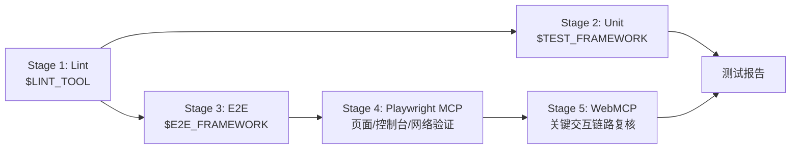

# 步骤 ⑨: Test Pipeline — 测试执行

## 输入

`tests/unit/` 和 `tests/e2e/` 内的测试文件，以及 Playwright MCP 的验证产物

## 输出

`tests/reports/<slug>-<timestamp>.md` — 测试执行报告  
`tests/reports/playwright/<slug>-<scenario>.md` — Playwright MCP 验证记录  
`tests/reports/webmcp/<slug>-<scenario>.md` — WebMCP 验证记录

## 详细行为

### 1. 五阶段执行



### 2. Stage 1: Lint

快速失败，代码静态检查：

```bash
# 读取 LINT_TOOL 配置
LINT_TOOL=${LINT_TOOL:-eslint}

case "$LINT_TOOL" in
  eslint)
    echo "🔍 运行 ESLint..."
    npx eslint . --max-warnings 0
    ;;
  biome)
    echo "🔍 运行 Biome..."
    npx biome check . --error-on-warnings
    ;;
  *)
    echo "⚠️ 未知的 LINT_TOOL: $LINT_TOOL"
    ;;
esac
```

### 3. Stage 2: Unit Tests

```bash
# 读取 TEST_FRAMEWORK 配置
TEST_FRAMEWORK=${TEST_FRAMEWORK:-jest}

case "$TEST_FRAMEWORK" in
  jest)
    echo "🧪 运行 Jest 单元测试..."
    npx jest tests/unit/ --coverage --json --outputFile=tests/reports/jest-output.json
    ;;
  vitest)
    echo "🧪 运行 Vitest 单元测试..."
    npx vitest run tests/unit/ --coverage --reporter=json
    ;;
  mocha)
    echo "🧪 运行 Mocha 单元测试..."
    npx mocha tests/unit/ --reporter json > tests/reports/mocha-output.json
    ;;
  *)
    echo "⚠️ 未知的 TEST_FRAMEWORK: $TEST_FRAMEWORK"
    ;;
esac
```

### 4. Stage 3: Playwright 预检

```bash
echo "🎭 运行 Playwright E2E 测试..."
npx playwright test tests/e2e/ --reporter=html,json

if [ -f "playwright-report/index.html" ]; then
  echo "📊 Playwright 测试报告已生成"
fi
```

### 5. Stage 4: Playwright MCP 最终功能验收（不可跳过）

Playwright 预检通过后，**必须**使用 Playwright MCP 工具做最终浏览器层功能验收。
这一步不是占位符，Agent 必须真正调用以下 MCP 工具完成验收：

#### 验收流程

```
FOR EACH 关键用户路径 IN tasks.md 的验收标准:

  步骤 1: 启动应用（如未启动）
    → 确保 dev server 已运行（npm run dev / next dev 等）
    → 确认可访问的 URL（从 dev server 启动输出中获取，如 http://localhost:xxxx）

  步骤 2: 导航到目标页面
    → 调用 MCP 工具: browser_navigate(url)
    → 等待页面加载完成

  步骤 3: 获取页面快照，确认可见状态
    → 调用 MCP 工具: browser_snapshot()
    → 验证关键 UI 元素存在且内容正确
    → 记录: "✅ 页面可见状态符合预期" 或 "❌ 期望看到 X，实际看到 Y"

  步骤 4: 执行关键交互操作
    → 调用 MCP 工具: browser_click(element) / browser_type(element, text)
    → 模拟用户的核心操作路径（登录、提交表单、点击按钮等）
    → 每次操作后 browser_snapshot() 确认结果

  步骤 5: 检查控制台错误
    → 调用 MCP 工具: browser_console_messages()
    → 确认无未处理的 error 级别消息
    → 记录: "✅ Console 无错误" 或 "❌ Console 存在错误: ..."

  步骤 6: 截图留证
    → 调用 MCP 工具: browser_screenshot()
    → 保存截图到 tests/reports/playwright/ 目录

  步骤 7: 生成验收记录
    → 写入 tests/reports/playwright/<slug>-<scenario>.md
```

#### 验收记录格式

每个场景生成一份 `tests/reports/playwright/<slug>-<scenario>.md`：

```markdown
# Playwright MCP 验收记录

- **场景**: <scenario 描述>
- **URL**: <dev server 实际地址>
- **时间**: YYYY-MM-DD HH:mm:ss

## 验收项

| 检查项 | 结果 | 说明 |
|--------|------|------|
| 页面可见状态 | ✅/❌ | 关键元素是否存在且内容正确 |
| 交互操作响应 | ✅/❌ | 点击/输入后页面是否正确响应 |
| Console 错误 | ✅/❌ | 是否存在未处理的 error |
| 网络请求 | ✅/❌ | 关键 API 请求是否成功返回 |

## 截图证据


## 结论

**PASS** / **FAIL**
```

#### 失败处理

- 任何验收项 FAIL → 整个 Stage 4 判定为 FAIL
- FAIL 时必须记录具体失败原因，供修复阶段参考
- **不允许跳过此步骤**，即使 Playwright 预检已通过

### 6. Stage 5: WebMCP 交互复核

Playwright MCP 通过后，使用 WebMCP 对关键交互链路做最终复核：

```
FOR EACH 关键交互链路:
  1. 调用 WebMCP 打开目标页面
  2. 执行关键操作（表单提交、按钮点击、导航跳转）
  3. 验证用户可见反馈是否正确
  4. 确认与 Playwright MCP 结果一致
  5. 生成验收记录 → tests/reports/webmcp/<slug>-<scenario>.md
```

验收记录格式同 Stage 4。最终通过结论只能由 **Playwright MCP + WebMCP 两层验证** 共同给出。

### 7. Stage 6: 生成最终验收报告（HTML 图表）

所有测试阶段完成后，必须生成一份 **HTML 格式的最终验收报告**，包含可视化图表和数据汇总。

产出文件：`tests/reports/<slug>-acceptance-report.html`

#### 报告内容要求

```
Agent 必须生成包含以下内容的 HTML 文件：

1. 基本信息头
   - 项目名称、迭代编号、执行时间、流水线总耗时

2. 阶段结果概览（饼状图 / 环形图）
   - 总体通过/失败比例
   - 各阶段状态（Lint / Unit / E2E / Playwright MCP / WebMCP）

3. 各阶段详细结果（横向柱状图）
   - 每阶段的通过数/总数、耗时、覆盖率

4. Requirement → Test 追溯矩阵（表格）
   - 需求 ID → 任务 ID → 测试文件 → Playwright MCP 证据 → WebMCP 证据
   - 每行用颜色标记通过/失败

5. 失败用例列表（如有）
   - 失败原因、所属阶段、截图链接

6. Playwright MCP 验收截图嵌入
   - 将 tests/reports/playwright/ 下的截图直接嵌入报告

7. 结论与建议
   - PASS / FAIL 最终判定
   - 风险项和改进建议
```

#### HTML 报告模板结构

Agent 生成的 HTML 必须是单文件可直接打开（内联 CSS + JS）：

```html
<!DOCTYPE html>
<html lang="zh-CN">
<head>
  <meta charset="UTF-8">
  <title>验收报告 - <slug> - <date></title>
  <style>
    /* 内联样式：深色主题、叡牠牙风格、响应式布局 */
    :root { --bg: #0f172a; --card: #1e293b; --pass: #22c55e; --fail: #ef4444; --warn: #f59e0b; }
    body { font-family: 'Inter', sans-serif; background: var(--bg); color: #e2e8f0; margin: 0; padding: 2rem; }
    .card { background: var(--card); border-radius: 12px; padding: 1.5rem; margin-bottom: 1.5rem; }
    .pass { color: var(--pass); } .fail { color: var(--fail); }
    /* ... 图表容器、表格、截图样式 ... */
  </style>
</head>
<body>
  <h1>📊 验收报告</h1>

  <!-- 1. 基本信息 -->
  <div class="card">
    <h2>基本信息</h2>
    <p>项目: ... | 迭代: ... | 时间: ... | 总耗时: ...</p>
  </div>

  <!-- 2. 阶段结果饼状图 -->
  <div class="card">
    <h2>测试阶段概览</h2>
    <canvas id="stageChart"></canvas>
  </div>

  <!-- 3. 详细结果柱状图 -->
  <div class="card">
    <h2>各阶段详细结果</h2>
    <canvas id="detailChart"></canvas>
  </div>

  <!-- 4. Requirement → Test 追溯矩阵 -->
  <div class="card">
    <h2>需求追溯</h2>
    <table><!-- 动态生成行 --></table>
  </div>

  <!-- 5. Playwright MCP 截图证据 -->
  <div class="card">
    <h2>浏览器验收截图</h2>
    <!-- 嵌入 tests/reports/playwright/ 下的截图 -->
  </div>

  <!-- 6. 结论 -->
  <div class="card">
    <h2>结论</h2>
    <p class="pass/fail">✅ PASS / ❌ FAIL</p>
  </div>

  <script>
    // 使用原生 Canvas 或内联 Chart.js CDN 绘制图表
    // Agent 根据实际测试结果填充数据
    const stageData = {
      labels: ['Lint', 'Unit', 'E2E', 'Playwright MCP', 'WebMCP'],
      pass: [1, 25, 8, 3, 3],
      total: [1, 25, 8, 3, 3]
    };
    // ... 图表绘制逻辑 ...
  </script>
</body>
</html>
```

#### 图表实现要求

- **单文件**：所有 CSS、JS、图表必须内联，不依赖外部文件（CDN 除外）
- **图表库**：可使用 Chart.js CDN（`<script src="https://cdn.jsdelivr.net/npm/chart.js"></script>`）或纯 Canvas 绘制
- **响应式**：支持桌面和移动端查看
- **截图嵌入**：将截图转为 base64 内联，或使用相对路径引用
- **颜色编码**：PASS = 绿色，FAIL = 红色，WARNING = 黄色

### 8. 并行执行

Stage 2 和 Stage 3 可以并行执行（如果无依赖）：

```bash
# 默认串行，只有当 E2E 不依赖 lint/build 产物时才允许并行
PARALLEL_TESTS=${PARALLEL_TESTS:-false}

if [ "$PARALLEL_TESTS" = "true" ]; then
  echo "🚀 并行执行 Unit 和 E2E..."

  run_unit_tests &
  PID_UNIT=$!

  run_e2e_tests &
  PID_E2E=$!

  wait $PID_UNIT || UNIT_EXIT=$?
  wait $PID_E2E || E2E_EXIT=$?

  UNIT_EXIT=${UNIT_EXIT:-0}
  E2E_EXIT=${E2E_EXIT:-0}

  if [ "$UNIT_EXIT" -ne 0 ] || [ "$E2E_EXIT" -ne 0 ]; then
    echo "❌ 部分测试失败"
    exit 1
  fi
else
  run_unit_tests
  run_e2e_tests
fi
```

### 8. 测试报告生成

```bash
# tests/reports/<slug>-<timestamp>.md
TIMESTAMP=$(date +%Y%m%d-%H%M%S)
REPORT_FILE="tests/reports/${SLUG}-${TIMESTAMP}.md"

cat > "$REPORT_FILE" << 'EOF'
# 测试执行报告

## 基本信息

- **执行时间**: YYYY-MM-DD HH:mm:ss
- **迭代**: <seq>-<slug>-<type>
- **测试框架**: $TEST_FRAMEWORK
- **Playwright**: precheck only
- **Playwright MCP**: required
- **WebMCP**: required

## 测试结果

| 阶段 | 状态 | 通过/总数 | 覆盖率 |
|------|------|-----------|--------|
| Lint | ✅ | - | - |
| Unit | ✅ | 25/25 | 85% |
| Playwright 预检 | ✅ | 8/8 | - |
| Playwright MCP | ✅ | 3/3 | 页面、控制台、交互已验证 |
| WebMCP | ✅ | 3/3 | 关键交互链路已复核 |

## Requirement → Test Matrix

| Requirement ID | Task IDs | Test File | Scenario ID | Playwright MCP Evidence | WebMCP Evidence |
|----------------|----------|-----------|-------------|------------------------|------------------|
| R-001 | T-001 | tests/unit/web/logic/calculator.test.ts | - | - | - |
| R-003 | T-005 | tests/e2e/calculator/E2E-001-basic-calculation.e2e.ts | E2E-001 | tests/reports/playwright/calculator-E2E-001.md | tests/reports/webmcp/calculator-E2E-001.md |

## 失败用例（如有）

<!-- 如有失败，在此列出 -->

## 最终验收报告

详见 HTML 图表报告：`tests/reports/<slug>-acceptance-report.html`

## 建议

最终通过结论只能依据 Playwright MCP + WebMCP 两层交互验证给出。
EOF

echo "📋 测试报告: $REPORT_FILE"
```

### 9. 循环修复逻辑

```bash
round=1
max_rounds=${REVIEW_MAX_ROUNDS:-1}

while [ $round -le $max_rounds ]; do
  echo "🧪 测试执行第 $round 轮..."

  # 执行测试
  run_lint
  run_unit_tests
  run_e2e_tests

  if all_tests_pass; then
    echo "✅ 所有测试通过"
    notify_tg "🧪 测试结果: <通过数>/<总数> 通过"
    exit 0
  fi

  if [ $round -eq $max_rounds ]; then
    echo "❌ 测试修复超过 $max_rounds 轮，需人工介入"
    notify_tg "⚠️ 测试修复超过 ${max_rounds} 轮，需人工介入 → 中止 Pipeline"
    exit 1
  fi

  echo "⚠️ 测试失败，Claude Code 修复中..."
  # Claude Code 根据失败信息修复

  round=$((round + 1))
done
```

## 命令模板

```bash
#!/bin/bash
set -euo pipefail

SLUG="$1"
TIMESTAMP=$(date +%Y%m%d-%H%M%S)
REPORT_FILE="tests/reports/${SLUG}-${TIMESTAMP}.md"

# 读取配置
LINT_TOOL=${LINT_TOOL:-eslint}
TEST_FRAMEWORK=${TEST_FRAMEWORK:-jest}
REVIEW_MAX_ROUNDS=${REVIEW_MAX_ROUNDS:-1}

run_lint() {
  case "$LINT_TOOL" in
    eslint) npx eslint . --max-warnings 0 ;;
    biome) npx biome check . --error-on-warnings ;;
    *) echo "未知的 LINT_TOOL: $LINT_TOOL" >&2; return 1 ;;
  esac
}

run_unit_tests() {
  case "$TEST_FRAMEWORK" in
    jest) npx jest tests/unit/ --coverage --json --outputFile=tests/reports/jest-output.json ;;
    vitest) npx vitest run tests/unit/ --coverage --reporter=json ;;
    mocha) npx mocha tests/unit/ --reporter json > tests/reports/mocha-output.json ;;
    *) echo "未知的 TEST_FRAMEWORK: $TEST_FRAMEWORK" >&2; return 1 ;;
  esac
}

run_e2e_tests() {
  npx playwright test tests/e2e/ --reporter=html,json
}

run_playwright_mcp_verification() {
  # ⚠️ 这不是 shell 脚本执行，而是 Agent 必须执行的 MCP 工具调用流程
  # Agent 应按以下步骤调用 Playwright MCP 工具：
  #
  # 1. 确保 dev server 已启动
  #    → 如果未启动，先执行 npm run dev（或项目对应的启动命令）
  #
  # 2. 对每个关键用户路径执行：
  #    a) browser_navigate(url)      → 打开目标页面
  #    b) browser_snapshot()          → 获取页面快照，确认 UI 元素
  #    c) browser_click / browser_type → 执行交互操作
  #    d) browser_snapshot()          → 确认操作后的页面状态
  #    e) browser_console_messages()  → 检查 console 无 error
  #    f) browser_screenshot()        → 截图留证
  #
  # 3. 生成验收记录
  mkdir -p tests/reports/playwright
  # Agent 将验收结果写入 tests/reports/playwright/${SLUG}-<scenario>.md
  # 格式参见上方「验收记录格式」
  #
  # 4. 判定结果
  #    → 所有检查项 PASS → Stage 4 PASS
  #    → 任何检查项 FAIL → Stage 4 FAIL，记录失败原因
  echo "🧭 Playwright MCP 验收完成"
}

run_webmcp_verification() {
  # Agent 使用 WebMCP 对关键交互链路做最终复核：
  #
  # 1. 打开目标页面
  # 2. 执行关键操作（表单提交、按钮点击、导航跳转）
  # 3. 验证用户可见反馈
  # 4. 确认与 Playwright MCP 结果一致
  #
  mkdir -p tests/reports/webmcp
  # Agent 将复核结果写入 tests/reports/webmcp/${SLUG}-<scenario>.md
  echo "🌐 WebMCP 复核完成"
}

generate_acceptance_report_html() {
  # Agent 必须生成 HTML 格式的最终验收报告
  # 产出文件: tests/reports/${SLUG}-acceptance-report.html
  #
  # 报告必须包含：
  # 1. 基本信息头（项目、迭代、时间、总耗时）
  # 2. 饼状图/环形图 — 阶段通过/失败概览
  # 3. 横向柱状图 — 各阶段通过数/总数/耗时
  # 4. Requirement → Test 追溯表 — 需求到测试的完整链路
  # 5. 失败用例列表（如有）
  # 6. Playwright MCP 截图嵌入（base64 或相对路径）
  # 7. 最终结论 PASS/FAIL
  #
  # 技术要求：
  # - 单文件 HTML，内联 CSS + JS
  # - 可使用 Chart.js CDN 绘制图表
  # - 深色主题，响应式布局
  # - 颜色编码：PASS=#22c55e FAIL=#ef4444 WARN=#f59e0b
  #
  mkdir -p tests/reports
  echo "📊 最终验收报告: tests/reports/${SLUG}-acceptance-report.html"
}

round=1

while [ $round -le $REVIEW_MAX_ROUNDS ]; do
  echo "🧪 测试执行第 $round 轮..."
  LINT_FAILED=0
  UNIT_FAILED=0
  E2E_FAILED=0

  # Stage 1: Lint
  echo "🔍 Stage 1: Lint..."
  run_lint || LINT_FAILED=1

  # Stage 2: Unit Tests
  echo "🧪 Stage 2: Unit Tests..."
  run_unit_tests || UNIT_FAILED=1

  # Stage 3: E2E Tests
  echo "🎭 Stage 3: E2E Tests..."
  run_e2e_tests || E2E_FAILED=1

  # Stage 4: Playwright MCP Verification
  CHROME_FAILED=0
  echo "🧭 Stage 4: Playwright MCP..."
  if [ "$E2E_FAILED" -eq 0 ]; then
    run_playwright_mcp_verification || CHROME_FAILED=1
  else
    CHROME_FAILED=1
  fi

  # Stage 5: WebMCP Verification
  WEBMCP_FAILED=0
  echo "🌐 Stage 5: WebMCP..."
  if [ "$CHROME_FAILED" -eq 0 ]; then
    run_webmcp_verification || WEBMCP_FAILED=1
  else
    WEBMCP_FAILED=1
  fi

  if [ "$LINT_FAILED" -eq 0 ] && [ "$UNIT_FAILED" -eq 0 ] && [ "$E2E_FAILED" -eq 0 ] && [ "$CHROME_FAILED" -eq 0 ] && [ "$WEBMCP_FAILED" -eq 0 ]; then
    echo "✅ 所有测试通过"

    # Stage 6: 生成最终验收报告（HTML 图表）
    echo "📊 Stage 6: 生成最终验收报告..."
    # Agent 必须生成 tests/reports/<slug>-acceptance-report.html
    # 包含：饼状图（阶段概览）、柱状图（详细结果）、追溯矩阵、截图嵌入
    # 参见上方「Stage 6: 生成最终验收报告」章节的完整要求
    generate_acceptance_report_html

    exit 0
  fi

  if [ $round -eq $REVIEW_MAX_ROUNDS ]; then
    echo "❌ 测试修复超过 $REVIEW_MAX_ROUNDS 轮"
    exit 1
  fi

  echo "⚠️ 测试失败，修复中..."
  round=$((round + 1))
done
```

## 错误处理

| 错误场景 | 处理方式 |
|----------|----------|
| 测试框架未安装 | 提示安装， abort |
| 测试文件不存在 | 警告，跳过该阶段 |
| E2E 测试超时 | 增加 timeout 配置 |
| Playwright MCP 未验证 | 视为测试未完成 |
| WebMCP 未验证 | 视为测试未完成 |
| 并行执行失败 | 回退为串行执行 |

## TG 通知文案

### 测试全部通过

```
🧪 测试结果: 全部通过 ✅
📊 Lint: ✅ | Unit: 25/25 | E2E: 8/8
📋 报告: tests/reports/<slug>-<timestamp>.md
```

### 测试失败（循环中）

```
🧪 测试结果: 部分失败
📋 失败用例: <列表>
📝 Claude 正在修复，请稍候...
```

### 测试修复超限

```
⚠️ 测试修复超过 {N} 轮，需人工介入
📋 失败测试: <列表>
📂 测试报告: tests/reports/<slug>-<timestamp>.md
```

## 相关文件

- 输入：
  - tests/unit/*.test.ts
  - tests/e2e/*.e2e.ts
- 输出：
  - tests/reports/<slug>-<timestamp>.md
- 参考：
  - references/test-generator.md（测试生成）
  - references/docs-updater.md（下一步）
